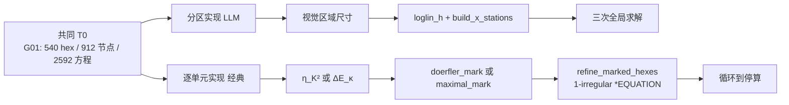
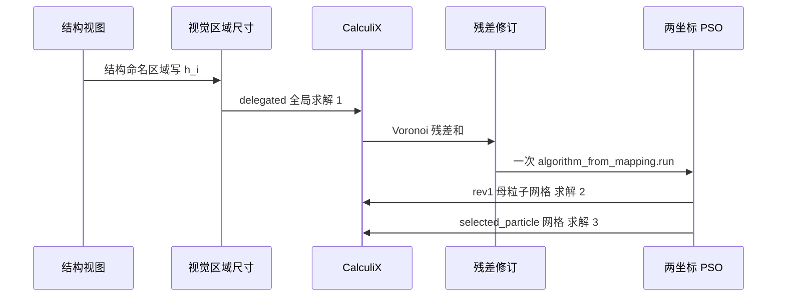
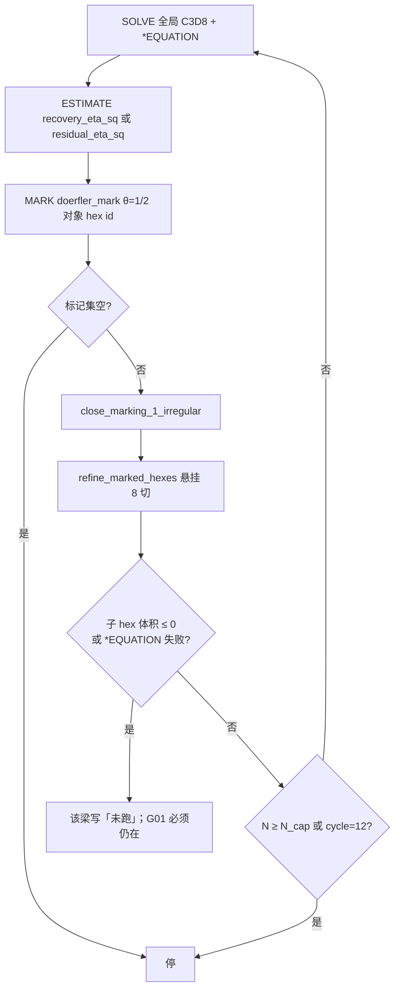
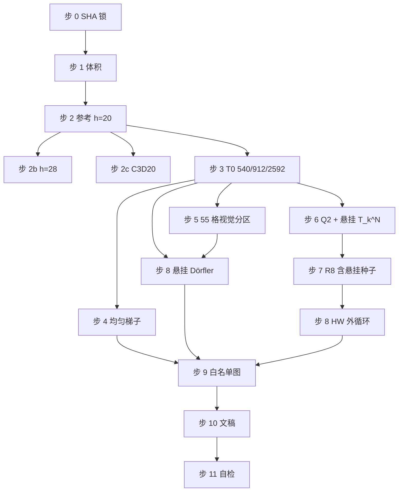

# 实体 T 梁上视觉分区相对逐单元标记：论文方案

- **文档类型**：MDPI *Applied Sciences* 研究论文的大纲与基本材料（不是成稿，不是 Results）
- **作者**：待填
- **日期**：2026-08-26
- **状态**：Draft
- **对象代码根**：`/workspace/demo-rl-calculix-tbeam/`
- **成稿 class**：`artifacts/two_papers/paper_local/Definitions/mdpi.cls`（期刊选项 `applsci`）

本文件是成稿与求解之前的逻辑主干。它相当于论文的大纲和基本材料：背景、相关工作、实验设置（含复现表）已经写成可执行的协议；后续对话按步卡在本机跑 CalculiX，用本次写出的 `.inp/.frd/.sta/.cvg` 与 SHA 填充 Results。任何数字若未附带本次执行产物，不得抄进摘要或 Results。禁止把旧稿 `artifacts/llm_amr_mdpi/manuscript.pdf`、预览 `/workspace/amr-paper-preview/manuscript.pdf`、账本 `STATUS.md`、`artifacts/tbeam_matrix/` 的句子改写后当成新实验。

本方案对话不跑 CalculiX，不编造求解产物，不 git push，不开 PR。

---

**窄问题（全篇锁死）：**

在冻结截面拓扑的三维实体 T 梁上，用 CalculiX C3D8，LLM 视觉分区（按结构命名的区域写尺寸 → 对数线性尺寸场 → 一次残差修订 → 两坐标 PSO；三次互不相同的全局求解）相对 **逐单元** Zienkiewicz–Zhu / 残差 Dörfler 与 **逐单元** Houston–Wihler 局部预测，落在何处？两边都必须按其论文写的对象来跑，比较必须同时在匹配的自由度 \(N\) **以及** 匹配的全局求解次数上读。实验的构造使得后续 Results 可以判断分区一侧是否更强。本方案不得把该判断写成已经得到的事实。

这不是「三次尺寸场击败 AFEM」。这不是「三块尺寸场相对完整 AFEM」。经典一侧的对象是单元 \(K\) 或 hex \(\kappa\)，不是跨向厚板，不是「先圈一块再决定这块加密多少」。LLM 一侧才是分区。

---

## 0. 边界、用户意图、skill、当前稿错在哪里

### 0.1 本文件给谁用

后续新开的 Grok Build 对话按本文件填一篇 MDPI *Applied Sciences* 研究论文，并按复现表和步卡在本机跑通求解、出图、编译 PDF。本文件写的是「这篇论文要回答什么、对照谁、网格和工况怎么锁、什么叫停」。执行对话填的是「这次算出来什么」。

执行对话不得发明本文件未写出的数：视觉区域名、\(x_i\)、委派 \(h_i\)、PSO 代数、适应度权重、塑性纤维定义、停算条款、T09 五元组、局部 p 验收门槛，全部已锁。写不进表的量不准跑。门自己判。不得每一步交回用户问要不要继续。

### 0.2 用户意图（要什么、不要什么、锁死的对象）

要：

1. 对象是三维实体 T 梁上的自适应网格，不是猫道，不是 2D 板主文。
2. 这篇论文要比的就是：**LLM 视觉分区强于逐单元标记**。实验为这一假设而建；在 `.frd` 出现之前，摘要不得把假设写成结论。
3. 经典一侧 = 逐单元标记。Dörfler 1996 的对象是单元 \(K\)。Houston–Wihler Algorithm 1 的对象是每个 hex \(\kappa\) 上带面邻居补丁的局部 Dirichlet 问题。两者都不是分区方法，都不是跨向厚板，都不是「圈一块局部再加密」。
4. LLM 一侧 = 视觉分区。Grok Build 看 T 梁结构视图，给结构命名的区域写尺寸（固端面、翼缘–腹板再入角、尖端翼缘荷载，外加随视图出现的结构条带）。区域个数跟视图走，不是预先切好的模板。然后：一次残差修订 + 两坐标 PSO。这才是分区。
5. 几何是一种可回收等截面 G01，外加十种真正不同的连续变截面。T01 是线性加腋，**不是** G01 的别名。
6. 工况五种：静力线弹性、两种塑性、两种动力。
7. 误差原点是三维 C3D8 细参考的自由端平均竖向位移，不是 Euler–Bernoulli。
8. 方案先于执行。复现表在实验设置章里，是这一章的一环，不是整份方案。
9. 图必须回答科学问题。诡异图不出。

不要：

1. 不要把欧拉梁位移当误差原点。
2. 不要把 Dörfler 写成自由度坐标，不要把 Dörfler 做成分区。
3. 不要把单元应变能 ALLSE 当误差指示子。
4. 不要用发明的「下一网格 \(\ge 3\times|T_0|\)」停 Houston–Wihler。
5. 不要把 C3D20 在面邻居补丁上 \(n_{\mathrm{free}}=0\) 的空问题画成局部预测结果。
6. 不要把四块取样、两轮包装器、CalculiX 2.23 拒绝的 C3D27 卡片当成 HW。
7. 不要把六集 REINFORCE 线性策略冒充 ASMR++ 对照。
8. 不要宣布科学成功、排名或「符合」。没有 `.frd/.sta` 的句子不进 Results。
9. 不要把 \(e_u\) 相对下降写成 Dörfler 停算。
10. 不要 push / 开 PR。不要用 Cursor 云端 agent 做计算。
11. 不要用 `tbeam_vision_picks.TAPER_NOTE` 的 \(h_{\mathrm{mm}}()\) 偏移（那份注记把 T01 当成 G01）。
12. 不要用 `physics.py` 的 \(f_y=40\) 与系数 1.25；不要用手写 −50000 N。
13. 不要再把 X0–X5 模板写成方法、专章或附录。
14. 不要把 LLM 做成 X0–X5 模板。区域个数跟视图走。

锁死的对象（后文复现表展开）：

- 求解器：CalculiX 2.23。入口脚本 `/workspace/agentic-work/ccx`（设置 `LD_LIBRARY_PATH` 后 exec 真二进制）。真二进制 `/workspace/agentic-work/calculix/extracted/CalculiX/ccx_2.23/src/ccx_2.23`，SHA-256 `31be21fc2f0902bd9a05acc2651dbac6dc2a2573dabbf235e39a38cb6f458862`。`/workspace/bin/ccx` 是另一份 ELF（BuildID 不同），禁止。
- 线性代数：SPOOLEs。
- 超时：全局静力 240 s，动力 600 s，局部问题 90 s。
- 全局单元：C3D8。局部 p 升阶禁止向 CalculiX 写 `TYPE=C3D27`。本树 `/workspace/agentic-work/calculix/extracted/CalculiX/ccx_2.23/src/` **只有**二进制 `ccx_2.23`（SHA 同上），没有 `.f` / `.f90` 源文件可 grep。操作锁是：不写 `TYPE=C3D27`；p 枝用进程内 Q2。仓库旧 artifact 已记录该二进制拒绝 C3D27 卡片。
- 单位：mm, N, MPa, t, s。
- 材料示意钢：\(E=2.1\times 10^5\) MPa，\(\nu=0.3\)，\(\rho=7.85\times 10^{-9}\) t mm\(^{-3}\)，\(f_y=235\) MPa。不是材性试验卡。
- 误差原点：细三维 C3D8 参考的自由端平均竖向位移，不是 Euler–Bernoulli。
- 分区一侧的全局求解次数：三次（委派、改一次、PSO 认证）。残差修订不叠成三次修订。禁止 `REVISION_STAGES` 的 rev2/rev3。
- 逐单元对照的循环：一直跑到停算条件，硬帽 12 轮（Dörfler）或 9 轮（Houston–Wihler Example 1），不是 2 轮。
- 十种变截面源：`scripts/tbeam_taper.py` 的 `FAMILIES`。G01 源：`scripts/tbeam_solid_hex.py`。
- Dörfler 1996 与 Houston–Wihler Algorithm 1 的加密原子：被标 hex 的悬挂 8 切 + 1-irregular 闭合 + CalculiX `*EQUATION`。**禁止** `split_x_stations` 充当 Dörfler 加密。

### 0.3 仓库固定流程 / skill

执行必须走本仓库已有的工程 skill。路径相对于 `/workspace/demo-rl-calculix-tbeam/`。三份 JSON 均已核存在。

| Skill | 路径 | 本篇用法 |
|---|---|---|
| `problem-definition-source-audit` | `skills/engineering/problem-definition-source-audit.json` | 每个几何量、荷载、材料、停算来自本方案锁死表或本次解析，禁止从旧 artifact 静默回填 |
| `mesh-convergence-and-singularity` | `skills/engineering/mesh-convergence-and-singularity.json` | 先定 QoI 与报告点，再加密；尖端点荷载与翼缘–腹板再入角的峰值应力不得冒充收敛；位移、能量、反力、路径量分开记 |
| `optimization-readiness` | `skills/engineering/optimization-readiness.json` | PSO 只开 \((s,\kappa)\)；适应度若用代理必须写明，终局必须有一次 CalculiX 认证 |

决策循环可以预存在：提出假设 → 选证据 → 写 deck → 求解 → 读 `.frd/.sta/.cvg` → 修正。路线不能预写死成「一定优于 Dörfler」。假设允许；结论必须等产物。

成稿只用 MDPI 官方 class：`Definitions/mdpi.cls`，期刊选项 `applsci`。仓库落盘：`artifacts/two_papers/paper_local/Definitions/` 与 `artifacts/two_papers/mdpi_style/`。

### 0.4 当前稿与上一份方案把经典方法写成了分区

当前英文稿 `/workspace/demo-rl-calculix-tbeam/artifacts/llm_amr_mdpi/manuscript.pdf` 与预览 `/workspace/amr-paper-preview/manuscript.pdf` 不得作为新实验的数字来源。它们把三个必须在方案层切断的错误写进了「结果」。上一份 `/workspace/amr-plan/PLAN.md` 本身也被污染：把 Dörfler 写成含被标 \(K\) 的站的协调切分、把 X0–X5 模板写成可选方法与附录、把窄问题写成「三点尺寸场相对完整 AFEM」。本文件重写科学主线，不沿用那一份的 §3.10 与附录。

**为何 ZZ–Dörfler 两三轮就像已经收敛。** 实现是 `src/tbeam_family/amr.py::run_element_doerfler`：逐单元算 \(\eta_K^2\)，Dörfler 标记 hex \(K\)，然后把含 \(K\) 的整段跨向站二等分（`split_x_stations`，`src/paper_local_prediction/doerfler_span.py`，以及 `tbeam_family.adapt.run_element_doerfler_family` / `campaign.phase_doerfler` / `e2e.run_doerfler_pair`，默认 `n_cycles=2`）。这是一次把自由度整板堆到固端。尖端位移被固端转动支配，两刀切站就会看起来贴上参考。那不是 Dörfler 1996。Dörfler 1996 的加密原子是被标单元本身。污染审计里把那种实现叫做 spanwise-station bulk，此后正文不再用这个词。本战役删除该原子。

**为何局部预测看起来像分区。** Houston–Wihler 2016 Algorithm 1 的对象是每个 hex \(\kappa\) 上的面邻居补丁 \(T_\kappa^N\) 局部 Dirichlet 问题（`papers.py` 键 `HW-alg1`、`HW-local-dirichlet`、`HW-mark`，\(\theta=1/3\)）。用户说「圈局部区域然后自己计算加密程度」是误读：论文是对每一个 \(\kappa\) 做局部问题，不是先画一块再决定这块加密多少。仓库里把局部预测做成跨向厚板背包、空 C3D20 条形图、C3D27 卡片、两轮包装器的，不是那篇论文。本战役实现 HW 逐单元、进程内 Q2 p 枝、外循环到 Example 1 的 9 次加密。

**为何「AMR 六区」是错的。** 同一份 2026-08-15 硬编码模板，不是视觉，不是 Dörfler，不是 HW。视觉代码已经拒绝该模板：`scripts/draw_tbeam_structure_vision.py`（`do not emit the PDF six-zone template`，禁止热点名 `X0`–`X5`）、`src/tbeam_family/vision.py`（`len(spots)==6` 即拒绝）、`scripts/draw_tbeam_taper_vision.py`。本战役保持拒绝，不把它复活成「AMR 的六个区域」。

### 0.5 六区硬编码从哪里来（只在此处把方法说清楚，然后从论文里删除）

不是发表论文，不是 Houston–Wihler，不是 Dörfler。仓库内 **2026-08-15** 技术基线：

- 主说明：`/workspace/demo-rl-calculix-tbeam/artifacts/local_prediction_spec/local_prediction_algorithm_zh.txt`
- 页眉：`技术基线审计说明 / 2026-08-15`
- 标题：`六个完整截面区段 × 三级 h 加密 × 全外边界 Dirichlet 局部能量释放 × 固定 DOF 带多选择背包`

硬编码区间（与 `src/local_prediction/geometry.py` 的 `PATCHES`、`src/paper_local_prediction/spanwise.py` 的 `PDF_PATCHES` 同一组数）：

| 区段 | \(x\) 区间 (mm) |
|---|---|
| X0 | 0–120 |
| X1 | 120–400 |
| X2 | 400–800 |
| X3 | 800–1300 |
| X4 | 1300–1700 |
| X5 | 1700–2000 |

L1 / L2 / L3 对应 \(h=55 / 27.5 / 13.75\) mm（`H_COARSE=110`，`LEVEL_H={1: h/2, 2: h/4, 3: h/8}`）。18 个动作（`N_ACTIONS=18`），每区至多一级，90%–100% DOF 带最大化 \(\sum q\)，编译六个目标 \(h\)，一次终局全局求解。

仍在编码它的入口（全部禁止当本战役生产方法）：

- `src/local_prediction/gmsh_tbeam.py`（`need six zone sizes`，六个 Box field）
- `src/local_prediction/multilevel_local_predictor.py`（`N_ACTIONS`，X0–X5 × L1–L3）
- `src/local_prediction/run_experiment.py`、`src/local_prediction/geometry.py`
- `scripts/run_local_prediction.py`
- `src/paper_local_prediction/spanwise.py`、`pdf_local.py`、`draw_grid.py`（注释 `Discrete X0–X5`）
- `src/paper_local_prediction/papers.py` 的 `RULES["Doerfler-bulk"]` 仍把 bulk 写到跨向站并 `split_x_stations`——该卡是污染；本战役 Dörfler 协议覆盖该卡：1996 单元对象 + 悬挂 8 切，不是该卡「this TBEAM-G01 run」那段。

用户原句「六区居然还没去掉」「amr的六区域也是错的 我就想知道这个硬编码哪里来的？」：答案就是 2026-08-15 这份说明和上列函数，不是文献。本篇回答一次之后，删除该方法：不进实验、不进专章、不进附录、不进图白名单、不进学习对照的「备用基线」。

---

## 1. 背景

### 1.1 问题

把 T 梁写成三维实体而不是 Euler–Bernoulli 或 Timoshenko 杆，离散问题里至少有三处需要局部分辨率：固端约束面、翼缘–腹板再入角、自由端荷载导入。均匀六面体把大多数自由度花在跨中光滑区。自适应网格加密（AMR）是经典答案。它的代价也是经典的：每一轮都要一次全局装配与求解、一次单元指示子、一次标记、一次网格更新。Houston–Wihler 的局部能量预测还要在每个被问到的单元上再解局部 Dirichlet 问题。对三维 C3D8 T 梁，这个外循环很快变成「一个全局加上几百个局部」。

工程上另一条路不是再做一轮标记，而是读结构、把梁分成几块结构部位、给每块写一个尺寸。固端面细、凹角细、加载端细、光滑跨中粗。这是分区：区域是结构对象，尺寸是区域上的场，网格由尺寸场生成。视觉读结构、区域智能体用当前残差改一次尺寸、粒子群只校准剩下的两个坐标，是这条路的一个短循环。短循环要成立，必须同时满足：

1. 三次全局网格的方程数互不相同；尺寸场在有序区域中心之间连续（对数线性），不是预先切好的分段常数厚板。
2. 对照是按论文写的逐单元循环，而不是把经典方法也做成分区。
3. 误差轴是三维参考，不是更软的梁理论。C3D8 悬臂因剪切与固端约束比欧拉梁更刚；用欧拉位移当真解会奖励「仍然太刚」的粗网格。
4. 比较同时在匹配 \(N\) 和匹配全局求解次数上读。只比 \(N\) 会掩盖「经典每一轮都要一次全局求解」；只比三次求解会掩盖两边网格原子不同。

本篇要回答的就是文首的窄问题。贡献不是新的 GNN，也不是「三次已经最优」。贡献是把两种 discretisation 哲学放回同一对象：一边是工程师式的视觉分区，一边是论文式的逐单元标记。假设是分区更强；是否成立，由本次 `.frd` 决定。

### 1.2 对象上的难点

T 梁不是模型椭圆方程。

- 自由端合力落在翼缘顶节点上，是点荷载奇异。`mesh-convergence-and-singularity` 禁止用加载点的应力峰值宣布网格收敛。报告位移用翼缘顶自由端节点的平均 \(u_z\)；报告应力用离开加载点一个翼缘厚度的路径或环平均。
- 翼缘–腹板再入角。冻结 T 截面离散（腹板 \(2\times 5\)、外挑 4、翼缘厚 2）故意不加密截面内的凹角。分区方法在这一族上只能调跨向间距。逐单元 8 切可以进截面。两套离散实现不能假装原子相同；主图必须有题注，禁止再叠成一张「所有方法」的假 Pareto。
- 十种变截面改变的是 \(b_f,t_f,t_w,h_w\) 沿跨的定律。高度加腋会改变弯曲刚度分布，指示子若只看残差密度可能把加密赶到薄端。这是对象性质，不是优化器失败的自动证明。T01 根部腹板高 200 mm、自由端 80 mm，与等截面 G01 不是同一根梁。
- 塑性与动力不再满足 Houston–Wihler 的线性自伴随能量恒等式。这两种工况检验分区短循环是否仍能编出三套不同网格，以及塑性区 / 峰值位移是否随 \(N\) 移动；它们不进入 S-LIN 的误差轴。无非线性细参考则不对 \(e_u\) 排序。允许声称的上限是「三套网格仍然可解」。

### 1.3 技术上的难点

- CalculiX 2.23 的 C3D8 是位移协调八节点六面体，体积锁定与剪切锁定由所有方法共享。相对排序只在同一单元族内有效。C3D20 参考只作 G01 的一次敏感性（步 2c），不另开误差轴；ccx 失败则记录并继续。
- 面邻居补丁上，C3D20 的全部节点都在 \(\partial D(\kappa)\) 上，局部 p 问题空。这是实现约束。本方案用补丁内的三二次（27 节点 Q2）局部问题把 p 做可解，组装在进程内，而不是把空问题画成图，也不是把 CalculiX 拒绝的 C3D27 卡片再送一次。
- 结构化 T 网格若不允许悬挂，逐单元标记只能整站切开，于是「Dörfler」退化成一维固端加密器——这正是当前稿「两三轮已经收敛」的机制。本方案不再把这种退化写成对照方法。Dörfler 与 HW 的加密原子是悬挂 8 切。分区一侧用对数线性尺寸场生成协调网格。均匀梯子活在分区网格族上，因为它不是标记方法，只回答「多给 \(N\) 是否自然下降」。
- 粒子群若用幂律代理当适应度，它校准的是代理而不是 CalculiX 残差。终局必须有一次真实求解。代理曲线不得冒充误差曲线。委派阶段不跑 PSO，不得用视觉先验的 `reference_error` 做认证。
- 一维对数线性尺寸场不能在同一 \(x\) 上放两个区域锚。近尖腹板区域的 \(x_i\) 从视觉盒中点 1920 mm 挪到 1880 mm，以免与自由端翼缘区域（1960 mm）撞车。这条是尺寸场几何，不是新算法。

### 1.4 当前仓库已经说明了什么（不是本篇结果）

这些是方案必须面对的既有事实，不是可引用的论文数字。禁止把它们抄进 Results。

- G01 粗网格名义 \(h=110\) mm、**18 个跨向单元**（`uniform_x_stations(18)` → 19 个 \(x\) 节点，均匀步 \(2000/18\) mm）、540 个 C3D8、912 节点、2592 方程，是可回收包装的 T0。禁止把「18 站」读成 18 个节点站（那会变成 17 cell / 510 hex）。体积恒等式 \(1.52\times 10^7\) mm\(^3\)。
- 简单 ZZ 1987 恢复指示子与面跳跃残差指示子的代码在 `src/paper_local_prediction/recovery.py`、`residual.py`。标记在 `marking.py` 的 `doerfler_mark`（对象 hex id）与 `maximal_mark`（HW (4.12)）。悬挂 8 切在 `hex_mesh.refine_marked_hexes` + `close_marking_1_irregular` + `hanging_equations`。
- 把含被标 hex 的跨向站切开，在 G01 上两轮就会把自由度一次性堆到固端。这正是「三次就很好」的来源。本方案不沿用它当经典循环，也不把旧稿尖端误差百分比写入任何新表。
- Houston–Wihler 外循环曾被错误的 3× 规则在 \(n=1\) 处停掉；`stop.py` 已写明应 line 14 回去。`tbeam_family.amr.run_hw_slin` 默认仍是 `enrichments=("h",)`、`sufficient_iterations=2`、`max_hexes=1600`。本方案按 9 轮帽重跑，且必须先有可解 p 枝；禁止调用 `run_hw_slin`。
- 视觉区是结构部位（固端面、凹角、加载翼缘、动力腹板、变截面特征条带），个数跟视图与工况走。视觉网格站距 80 mm，T0 站距约 110 mm；尺寸场用几何盒的跨向中心，不用那些 eid。
- 几何目录至少有三套互相打架的 T01–T10（`scripts/tbeam_taper.py` FAMILIES、`src/tbeam_family/sections.py` V01–V10、`src/tbeam_family/catalog.py`、以及把 T01 写成 G01 的英文稿与 `tbeam_vision_picks.TAPER_NOTE`）。本方案只锁 `tbeam_taper.py` 的 `FAMILIES`，见 §3.3。`tbeam_solid_hex.PRISMATIC.taper_id=="T01"` 且 zh=「等截面 G01」——方案把它当禁入口，不当几何源。
- 塑性屈服有 40 MPa（`src/tbeam_family/physics.py` 的 `FY_ILLUSTRATION_MPA`）与 235 MPa 两套；塑性系数有 1.25（`physics.py`）与 1.35（`scripts/tbeam_solid_hex.py` 的 `plastic_force_n`）两套；S-KIN 反向有全反向（`tbeam_family/cases.py` 的 \(\pm 50000\)，以及 `physics.py` 的 `reverse=True` 全反向）与 \(-0.5F\)（`tbeam_solid_hex.write_inp`）两套。`plastic_force_n` 内部走 `get_taper` / `TAPERS`，其中 **T01 是等截面 G01**，与 `tbeam_taper.FAMILIES` 的线性加腋 T01 不是同一根梁。本方案只锁 235 MPa、系数 1.35、截面局部极值纤维（§3.4）。
- `one_shot_region_pso.py` 的 `AlgorithmConfig` 与 `fem_informed_revisions.py` 的 `REVISION_CONFIG` 半径不同。本方案只取前者的超参数；后者只借 `payload_from_indicators` 改写参考误差 / 资源 / 目标，事后必须覆盖 config。
- 两轮包装器（全部禁止当生产入口）：`tbeam_family.amr.run_hw_slin`；`run_element_doerfler` / `run_element_doerfler_family` / `phase_doerfler` / `e2e.run_doerfler_pair`（默认 `n_cycles=2`，加密原子都是含被标 \(K\) 的站）；`paper_local_prediction.doerfler_span.run_element_doerfler`。
- `tbeam_taper.write_inp` 经 `physics.force_for_case` 带回 \(f_y=40\)、1.25、S-KIN 全反向、动力 −5000。禁止生产 deck。
- `tbeam_solid_hex.build_x_stations(sizes)` 在区域名为视觉区时用盒中点，可能把 `web_nlgeom` 从 1880 挪到 1920。尺寸场必须用 §3.6.2 的 \((x_i,h_i)\) + `from tbeam_solid_hex import loglin_h` + `tbeam_taper.build_x_stations`。
- `adapt.predict_many` 默认 `HW_WORKERS=1`；`algorithm1.one_cycle` 用同一 `timeout_s` 打全局和局部。本战役必须 `HW_WORKERS=8`，全局静力 240 s / 局部 90 s。
- `algorithm1.run_algorithm1` 若工作目录已有 `predictions_n{n}.json` 会复用旧局部记录。步 8 工作目录必须空。
- 六区模板的溯源见 §0.5。`papers.py` 的 `Doerfler-bulk` 卡仍描述跨向站 bulk——本战役协议覆盖该卡，不把该卡当生产说明。

---

## 2. 相关工作

相关工作按四簇写。成稿时每条主张必须能指到主键文献。Dörfler 1996、Zienkiewicz–Zhu 1987、Houston–Wihler 2016 的 PDF **不在** `/workspace/priors/`，`papers.py` 的 `read=` 指向 `/tmp/papers/`，那里也不是这三篇。Related Work 引用公式时只准用 `src/paper_local_prediction/papers.py` 的 `RULES` 卡片与代码常量，禁止发明未读页码。执行对话若本机另有 arXiv PDF 可再核；否则停在 `RULES`。

仓库先验（可核、不是本篇结果）：

| 簇 | 落盘 |
|---|---|
| ASMR | `/workspace/priors/vla/ASMR_2304.00818.pdf` |
| Foucart DRL AMR | `/workspace/priors/vla/Foucart_DRL_AMR_2209.12351.pdf` |
| Yang RL AMR | `/workspace/priors/vla/RL_AMR_Yang2023.pdf` |
| LAMG | `/workspace/priors/lrrc/LAMG_2505.20457.pdf` |
| AMBER | `/workspace/priors/lrrc/AMBER_2505.23663.pdf` |
| MeshingNet | `/workspace/priors/sizing/2004.07016_MeshingNet.pdf`；MeshingNet3D 同目录 |
| Loseille–Alauzet | `/workspace/priors/lrrc/LoseilleAlauzet_contmesh_I.pdf`、`_II.pdf` |
| Amor-Martín *Appl. Sci.* 11, 3683 | **不在** priors；仓库副本 `/workspace/demo-rl-calculix-tbeam/artifacts/two_papers/mdpi_style/applsci-11-03683.pdf` |

`papers.py` 公式卡本篇实际用到的键：`HW-E` (2.4)/(4.1)、`HW-local-dirichlet` (4.5)、`HW-p` (4.7)/(4.8)、`HW-h` (4.9)/(4.10)、`HW-max` (4.11)、`HW-mark` (4.12)、`HW-alg1`、`HW-repeat`、`HW-stop`、`BR-stop` §6、`Doerfler-bulk`（**只取 1996 的单元对象与集体不等式；该卡后半「跨向站 / split_x_stations」由本战役协议覆盖**）。常量 `THETA_HW=1/3`、`THETA_DOERFLER=1/2`。

**不设**「跨向厚板背包局部预测」相关工作小节。那不是对照方法，是污染源，已经在 §0.5 交代并删除。

### 2.1 经典 h 自适应：指示子、Dörfler、停算

Dörfler（1996）对 Poisson 证明：按指示子平方的集体份额 \(\theta\) 做极小基数标记，再加密、再求解，自适应循环收敛。对象是单元 \(K\)，不是自由度，不是跨向厚板，不是「一块你圈出来的局部」。\(\theta=1/2\) 是本篇比较默认，不是新算法（`RULES["Doerfler-bulk"]` 的 1996 不等式部分）。Morin–Nochetto–Siebert（2000）指出数据振荡；Cascón 等（2008）、Stevenson（2007）给出准最优率。这些定理不把「两轮之后的尖端位移」定义成真解。

Zienkiewicz–Zhu（1987）用结点平均应力构造恢复指示子，是工程代码里的工作马。1992 的超收敛补丁恢复（SPR）更精，本篇不实现 SPR，文中必须写「简单 ZZ，不是 SPR」。Ainsworth–Oden 与 Verfürth 的残差估计把体积残差与面跳跃分开；本对象体力为零、C3D8 一点应力，残差指示子由内部跳跃与 Neumann 不平衡主导。Chamoin–Legoll（2021）的综述用来把「解–估计–标记–加密」写成正确性来源，而不是一次视觉分片。

Amor-Martín 与 Garcia-Castillo（2021，*Appl. Sci.* 11, 3683）在 prismatic 电磁问题里做半结构化 h 自适应，并显式写出协调步以避免悬挂。这是**协调网格文献**，不是改写 Dörfler 对象的许可证。本战役不得引用该文来把 Dörfler 做成整站切开。Dörfler 的加密原子在本对象上实现为悬挂 8 切；协调尺寸场属于分区一侧。

Babuška–Rheinboldt（1978）给出顶点星局部 Dirichlet 问题与「给定精度或给定费用」的停算（`RULES["BR-stop"]`，§6）。费用与精度必须事先规定。3× 粗网格、ALLSE 文件与组装差，都不是 \(\|e\|\)。本战役默认不给精度容差，以免发明 \(\|e\|\)。若给出 hex 费用帽，只能是 \(4\times|T_0|=2160\)；本战役默认 `max_hexes=None`，该帽关闭。

本篇从这一簇拿走的对照协议：逐单元 \(\eta_K^2\)；集体标记 \(\theta=1/2\)；被标 hex 悬挂 8 切、1-irregular；循环直到空标记集、规定费用或硬帽；主图的横轴是方程数或全局求解次数，横轴名字不是「Dörfler」，图例不得把 Dörfler 画成分区。

### 2.2 局部能量预测与 hp 决策

Houston–Wihler（2016）在面邻居补丁 \(T_\kappa^N\) 上解一对局部 Dirichlet 问题，用预测的势能下降决定该单元走 h 还是 p，再用极大值规则（4.12）、\(\theta=1/3\) 标记。Algorithm 1 的 line 14 是 \(n\leftarrow n+1\) 回到全局求解；Example 1 报了 9 次自适应加密后的 hp 网格。Bammer–Schröder–Wihler（2025 / arXiv:2311.13255）把局部预测写成抽象循环，一维算例用 Dörfler 标记；本篇仍把 HW 的标记留在（4.12），不把 Dörfler 混进 HW 外循环（`RULES["Bammer-limit"]`）。Bammer 的层次模态与 \((L+1)\times(L+1)\) 局部密阵不实现，因为 CalculiX 不暴露那些模态。

势能 \(E_D=\tfrac12 a(u,u)-\ell(u)\)（HW (2.4)/(4.1)）。CalculiX ALLSE 是 \(\tfrac12 a(u,u)\)，不是 \(E_D\)。比较必须比势能，或把 ALLSE 单独与组装器 \(\tfrac12 a(u,u)\) 核对。

**局部预测不是分区。** 用户原句「圈局部区域然后自己计算加密程度」落在这一簇的误读上，不落在视觉分区上。HW 对网格中每一个 \(\kappa\) 构造 \(T_\kappa^N=\{\kappa\}\cup\) 面邻居，在 \(\partial D(\kappa)\) 上取当前全局位移做 Dirichlet，解一对局部问题。没有「先圈一块、再决定这块加密多少」的步骤。把局部预测做成跨向厚板背包，是 §0.5 的仓库产物，不是 Houston–Wihler。

关键实现事实必须写进方法而不是讨论里补一句：三维面邻居补丁上，二次 serendipity 六面体的节点全在补丁边界，p 问题空；三二次（27 节点）才释放面心与体心。本篇用补丁内的 Q2 局部问题实现 p 枝，h 枝用补丁一致 8 切。全局混合阶若 CalculiX 无法挂，p 胜者在全局用一次 8 切实现，记录 `p_realized_as_h`。主文图例必须写成「local hp prediction, global h realisation」，不得画成已实现的 hp 网格，不得把 \(n_{\mathrm{free}}\) 条形图当结果。

### 2.3 学习标记、尺寸场与连续网格

Yang 等（AISTATS 2023）与 Foucart 等（JCP 2023）把标记写成 MDP。Freymuth 等的 ASMR（NeurIPS 2023）与 ASMR++（arXiv:2406.08440）把每个单元当群体智能体，用局部最大误差下降做奖励，策略是消息传递网络与 PPO。本对象上六集线性 softmax 不是该对照。主文 Related Work 叙述这些工作；实验不拿未训练到发表规模的策略进 Pareto。

监督尺寸场：MeshingNet / MeshingNet3D 用 ZZ 标签一次预测尺寸，再用标量比例对准 \(N\)。LAMG（Zhang 等，arXiv:2505.20457）同样是一次 GNN 尺寸场加全局比例。AMBER（Freymuth 等，NeurIPS 2025）迭代预测完整顶点尺寸，推理时仍用标量 \(c_t\) 对准预算。Loseille–Alauzet 的连续网格把嵌入族定义为固定各向异性形状的全局比例。这些工作共同说明：一次尺寸场之后，文献里真正被用的剩余自由度经常是一维比例。本篇的 \((s,\kappa)\) 把第二坐标写成资源中性转移；实验上若 \(\kappa\approx 0\)，应报告为与嵌入族一致，而不是失败。

本篇的 LLM 视觉分区不是这些网络的 retraining。它是工程师读结构部位后的区域尺寸，用一次真实残差修订，再用两坐标校准。它也不是把学习到的标记再拿去 8 切。对比轴是「分区 vs 逐单元标记」，不是「又一个 GNN」。

### 2.4 仓库里已经有、但不得直接当论文结果的东西

- `src/engineering_agent/one_shot_region_pso.py`：一次通信、一次对数步、PSO 只开 \((s,\kappa)\)。这是分区方法的超参数源与状态机。`AlgorithmConfig` 默认值是本战役唯一超参数文件。
- `src/engineering_agent/fem_informed_revisions.py`：`payload_from_indicators` 用来把委派求解后的残差写成参考误差 / 资源 / 目标；`REVISION_CONFIG` 的半径、`REVISION_STAGES` 的 rev2/rev3、`PSO_CONFIG` 的两代放大半径，全部不用。
- `src/tbeam_family/amr.py` 的 `run_element_doerfler`：指示子是逐单元的，加密原子却是含被标 hex 的跨向站。禁止当 Dörfler 1996。
- `src/tbeam_family/amr.py` 的 `run_hw_slin`：默认只 h、两轮、`max_hexes=1600`。禁止。
- `src/paper_local_prediction/algorithm1.py`：逐单元 HW 的骨架。生产 HW 只走这里 + `stop.py`，且必须在进程内 Q2 接通之后，`enrichments=("p","h")`、`sufficient_iterations=9`、`max_elements=0`。
- `src/local_prediction/`、`pdf_local.py`、`spanwise.py` 的 X0–X5：§0.5 的污染源，不是本篇方法。
- `artifacts/tbeam_matrix/`、`artifacts/llm_amr_mdpi/`、`artifacts/two_papers/`、`artifacts/paper_local_prediction/`：旧战役。数字可当调试线索，不可当本篇表。
- 2D 板 `clamp_top_corner / clamp_bottom_corner / right_edge_load_introduction` 与 `docs/upper_right_point_load_refinement.md`：只用于说明点荷载应力不收敛。不进 T 梁主文图。
- `examples/tbeam_s_lin_oneshot.json`、`tbeam_d_nlg_oneshot.json`：视觉委派 \(h\) 的来源之一；其中的 `config.pso_*_radius`（0.02 / 0.03）与 `resource_dimension=3` **不是**本战役超参数。委派 \(h\) 已抄进 §3.6 的区域表；认证必须用委派后的 Voronoi 残差，不是 JSON 里的 vision `reference_error`。

Related Work 成稿时四小节对应上面四簇。不把猫道、扎青吊桥、RL 控制 demo 写进本篇方法来源。

---

## 3. 实验设置

本章是论文 Materials and Methods 的底稿，也是复现表所在的章。执行只许按这里的对象、输入、工况、网格、求解器、产物和停算走。表 R1–R8 是这一章的一环，不是整份方案。重复量只在本节叙述一次；每个 job 行回头引用，不得再发明。

### 3.1 论文允许声称什么

允许：

- LLM 视觉分区相对逐单元标记，在匹配 \(N\) 与匹配全局求解次数上的位置。
- 分区一侧存在三次互不相同的 \(N\)（委派 / 一次修订 / PSO 认证）。
- Houston–Wihler 外循环在可解局部问题上的代价（局部问题数 × 墙钟），以及标记是否集中在固端与凹角。图例必须承认全局是 h 实现。
- 塑性 / 动力卡片上三套网格仍然可解，PEEQ 或峰值 \(u_z\) 如何随 \(N\) 变。无非线性细参考则不排序。

不允许（包括写进本方案时也不允许当成已成立的事实）：

- 「优于经典自适应 / beats AFEM」——本方案不得写进摘要；Results 只能在完整逐单元曲线与匹配 \(N\)、匹配求解次数都支持、且 QoI 不只尖端位移时才讨论。
- 「实现了 ASMR++ / LAMG / AMBER」。
- 「实现了 CalculiX C3D27」。
- 用欧拉梁误差轴。
- 把整站切开的 Dörfler 写成 Dörfler 1996。
- 把未跑完的 HW 两轮画进主 Pareto。
- 把委派 / 修订 / PSO 的阶段图当作主精度图。
- 把旧稿 Table 3/4 数字写进 Results。
- 任何 X0–X5 厚板背包的「结果」。
- 把 LLM 的尺寸场点画进悬挂 \(N\)–误差图并假装原子相同（比较图必须有题注；悬挂专用图不画尺寸场点）。

### 3.2 两套离散实现（不是两套 Dörfler）

比较若共用一种加密原子，要么委屈经典方法，要么委屈分区。本方案显式切开，并且**不再**给 Dörfler 准备一套「为了和尺寸场公平」的整站切开。

**分区实现（只属于 LLM，外加不是标记方法的均匀梯子与细参考）。** T 截面拓扑冻结：腹板 \(n_y=2,n_z=5\)，翼缘外挑 \(n_y=4\)，翼缘厚 \(n_z=2\)。`scripts/tbeam_solid_hex.py` 的 `build_mesh` 若 `n_web_z` / `n_out_y` 为 None，会按最薄壁厚自动加层；`tbeam_taper.build_mesh` 的 `through_counts` 同样会按 \(h_{\min}\) 改层数。分区网格 **禁止**走自动分支。执行必须显式传入 `n_web_y=2, n_web_z=5, n_out_y=4, n_flange_z=2`。尺寸场 \(h(x)\) 在有序视觉区域中心之间对数线性。跨向站推进用 `tbeam_taper.build_x_stations(h_at_x)`（从 \(x=0\) 起，下一步 \(\max(8,\,h(x))\)，若剩余长度 \(<0.35\times\) 当地步则并到 \(L=2000\)）。\(h_{\mathrm{at\,x}}\) 必须是 §3.6.2 有序 \((x_i,h_i)\) 的 `loglin_h`。禁止 `tbeam_solid_hex.build_x_stations(sizes)` 在视觉区名下走 `matching_vision_records` / 盒中点。均匀梯子与 \(h=20\) mm 参考也活在这一实现里，因为它们不是标记方法：它们用 `uniform_x_stations(n_cells)`，\(n_{\mathrm{cells}}\) 是跨向单元数。若需要「只加 \(N\)」的对照，用均匀梯子，不用假 Dörfler。

**逐单元实现（只属于经典方法）。** 同一 T0 出发，被标 hex 做一次 8 切，1-irregular 闭合（`close_marking_1_irregular`），悬挂约束用 CalculiX `*EQUATION`（`refine_marked_hexes` + `hanging_equations`）。这是 Dörfler 1996 与 Houston–Wihler Algorithm 1 的加密原子。Dörfler **永不**经 `split_x_stations` 跑。LLM 尺寸场点不画在悬挂专用 \(N\)–误差图上假装原子相同。

主文必须同时有两张比较图。禁止再把它们叠成一张不标原子的假 Pareto。比较协议：

1. \(e_u\) 对 \(N\)，题注写明分区网格是协调尺寸场、经典网格是悬挂 8 切。
2. \(e_u\) 对全局求解次数——这才是用户要的「经典慢 / 分区三次求解」图。分区侧横坐标为 1, 2, 3；Dörfler / HW 从 cycle 0 记到停。



#### 3.2.1 设计取舍（必须讨论，不是稻草人）

**取舍 1。保留整站切开的 Dörfler，「为了和尺寸场公平」。拒绝。** 这会把经典方法做成分区，正是两三轮看起来神奇的原因，用户已禁止。公平不靠改写 Dörfler 的对象；公平靠两张图：匹配 \(N\)（题注原子不同）与匹配全局求解次数。

**取舍 2。把 LLM 也做成「把视觉区域里的每个 hex 标上再 8 切」，从而两边共用悬挂原子。讨论后拒绝。** 这会让两边原子相同，看起来更干净，但本仓库已经实现、本篇要测的 LLM 方法是区域尺寸场，不是单元标记器。混用会把论文的对比轴塌掉。若将来要问「同样的悬挂 8 切下，视觉圈区是否优于 ZZ」，那是另一篇；本战役不跑。

**取舍 3。把 X0–X5 复活成「另一种分区基线」。拒绝。** 2026-08-15 硬编码，不是视觉，用户禁止方法 / 专章 / 附录。溯源见 §0.5。

**取舍 4。只在匹配 \(N\) 上比。不够。** 用户同时关心全局求解次数：经典每一轮都要一次全局求解，分区一侧三次。缺这张图就回答不了「经典慢」。

**取舍 5。用欧拉尖端位移当误差。拒绝。** C3D8 悬臂更刚；欧拉轴会奖励仍然太刚的粗网格。欧拉积分只进几何表数量级栏。

**风险（高）。** 两套原子画在同一张 \(e_u\)–\(N\) 上会被读成「同一方法族」。缓解：题注强制写原子；另出悬挂专用图，不画尺寸场点；主比较还要有 \(e_u\)–求解次数。

**风险（高）。** 进程内 Q2 未接通就跑 HW，会再次落到空 p。缓解：步 6 必须先算出有限 \(\Delta E_p\)；R8 协调 T0 三条不过则 HW 主 Pareto 降附录，悬挂 Dörfler 仍跑。

**风险（高）。** 今日 `hw_patch_elements` / `build_face_adjacency` 只配对四节点 `frozenset`，悬挂面上看不见邻居。缓解：步 6 必须交付悬挂感知的 \(T_\kappa^N\)（几何测试复用 `coarser_neighbours`，取无向闭包）；R8 加一枚悬挂界面种子。该构造未过门之前 **不得**跑 HW 外循环。禁止用 X0–X5 顶替。

**风险（中）。** 悬挂面上当前 `residual_eta_sq` 按四节点 `frozenset` 配对会漏跳跃。缓解：能装主从面积加权牵引则装；否则元数据写「悬挂面跳跃未计入」，**不停算改条款**。残差悬挂只在 G01 上跑到装配完成；T01/T02/T08 残差写「未跑」，不得用协调面残差冒充。ZZ 不受影响。

**风险（中）。** 分区三次 \(N\) 撞车。缓解：记失败场景，不把委派点画两次冒充迭代。逐单元 Dörfler **仍跑**：有第三点则费用帽含 \(4N_{\mathrm{PSO}}\)，无第三点则帽退化为 \(N_{\mathrm{ref}}\)。

**风险（中）。** 变截面 loft 六面体 8 切可能出现非正体积子单元；`refine_marked_hexes` 今日不查 Jacobian。缓解：每次 8 切后检查子 hex 体积；\(\le 0\) 或 `*EQUATION` 求解失败则该梁写「未跑」，G01 必须仍在。

### 3.3 几何目录（锁死一套）

可回收等截面与十种变截面分开编号。禁止再把 G01 叫 T01。

**G01。** 来源 `scripts/tbeam_solid_hex.py`。\(L=2000\) mm。顶翼缘 \(240\times 20\)，腹板 \(20\times 140\)，顶面 \(z=160\)，底缘 \(z=0\)。体积恒等式

\[
V = 2000\cdot 240\cdot 20 + 2000\cdot 20\cdot 140 = 1.52\times 10^{7}\,\mathrm{mm}^3.
\]

根 / 中 / 端截面四元组相同：\((b_f,t_f,t_w,h_w)=(240,20,20,140)\)。这是 AFEM 文献对照对象，也是 HW 全循环对象。

**T0（粗网格身份，G01 与 T01–T10 同一套计数）。** `uniform_x_stations(18)` 表示 **18 个跨向单元**（19 个 \(x\) 节点），均匀步 \(2000/18\approx 111.11\) mm，名义 \(h=110\) mm。禁止读成 18 个节点站（17 cell → 510 hex）。冻结 T 拓扑（显式 `n_web_y=2, n_web_z=5, n_out_y=4, n_flange_z=2`）。每站 30 个 hex（腹板 \(2\times 5=10\)，翼缘贴腹板 \(2\times 2=4\)，两侧外挑 \(4\times 2\times 2=16\)），\(18\times 30=540\)。每站 48 个节点 \(\times 19=912\)。无约束估计 \(3(912-48)=2592\)。**G01 与每一根 T01–T10 的 T0 都必须得到 540 hex、912 节点、2592 方程**；对不上则停，不得改计数凑。节点在 \(y,z\) 上随截面定律移动，计数不变。若变截面对不上，说明走了禁止的 `through_counts` 自动加层，不是「变截面节点会变」。

**T01–T10。** 来源 `scripts/tbeam_taper.py` 的 `FAMILIES`，函数 `_t01`–`_t10`。T01 是顶面水平 \(z=220\)、腹板高 \(200\to 80\) 的线性加腋，不是等截面。根部不必浅于自由端的限制只施加于「悬臂加腋」叙事；T04 跨中加高与 T10 不对称是对象应力测试，予以保留。T09 两处 80 mm 线性过渡，不是三段间断梁。沿跨底缘不必在 \(z=0\)：T01/T02/T03/T08/T09/T10 的 soffit 会抬升（T09 根部 \(z_{\mathrm{soffit}}=6\) mm）。塑性 \(I_{yy}\)、\(\bar z\) 相对该截面 soffit 计量，见 §3.4。

废弃、执行时不得读取当几何源或塑性目录：`scripts/tbeam_solid_hex.py` 的 `TAPERS` / `get_taper('T01')` / `PRISMATIC` 冒充变截面（该目录 T01 是等截面 G01）、`src/tbeam_family/catalog.py` 的 `GEOMETRIES`、`src/tbeam_family/sections.py` 的 `FAMILY` V01–V10、英文稿 Table 1 的「T01 prismatic G01」行、`scripts/tbeam_vision_picks.py` 的 `TAPER_NOTE` / `h_mm()`（该注记把 T01 当成 G01 再做偏移）。`PRISMATIC` / `get_taper(None)` **只**许用于 G01。

截面定律（mm），\(L=2000\)，\(\xi=x/L\)。四元组顺序 \((b_f,t_f,t_w,h_w)\)。体积与 \(u_z^{\mathrm{ref}}\) 留空，由步 1–2 填写；Euler 栏只进本表，不进误差。根 / 中 / 端数值已按 `_t01`–`_t10` 核过。

| ID | slug | 定律 | 根 | 中 \(x=1000\) | 尖 |
|---|---|---|---|---|---|
| G01 | tbeam_g01 | 等截面挤出 | (240,20,20,140) | (240,20,20,140) | (240,20,20,140) |
| T01 | t01_h_lin | 顶 \(z=220\)，\(h_w=200\to 80\) | (240,20,20,200) | (240,20,20,140) | (240,20,20,80) |
| T02 | t02_h_par | 顶 \(z=260\)，\(h_w=80+160(1-\xi)^2\) | (240,20,20,240) | (240,20,20,120) | (240,20,20,80) |
| T03 | t03_h_haunch | \(h_w=200\) 至 \(x=300\)，线性到 100（\(x=700\)），其后 100 | (240,20,20,200) | (240,20,20,100) | (240,20,20,100) |
| T04 | t04_h_mid | 底缘 \(z=0\)，\(h_w=90+130\sin(\pi\xi)\) | (240,20,20,90) | (240,20,20,220) | (240,20,20,90) |
| T05 | t05_bf_lin | \(b_f=360\to 140\)，\(h_w=140\)，\(t_f=20\) | (360,20,20,140) | (250,20,20,140) | (140,20,20,140) |
| T06 | t06_tf_lin | \(t_f=40\to 12\)，\(h_w=140\)，底缘 \(z=0\) | (240,40,20,140) | (240,26,20,140) | (240,12,20,140) |
| T07 | t07_tw_lin | \(t_w=36\to 12\)，翼缘 \(240\times 20\)，\(h_w=140\) | (240,20,36,140) | (240,20,24,140) | (240,20,12,140) |
| T08 | t08_combo | \(h_w=210\to 85\)，\(b_f=340\to 150\)，\(t_w=32\to 12\)，顶 \(z=230\) | (340,20,32,210) | (245,20,22,147.5) | (150,20,12,85) |
| T09 | t09_step3 | 两处 80 mm 过渡，五元组见下 | (300,24,28,190) | (240,20,20,140) | (180,16,16,95) |
| T10 | t10_asym | \(y_m=70\to 165\)，\(y_p=175\to 65\)，\(h_w=180\to 100\)，顶 \(z=200\) | (245,20,20,180) | (237.5,20,20,140) | (230,20,20,100) |

**T09 五元组**（源 `_t09`，顺序 \((h_w,\,b_f/2,\,t_w/2,\,t_f,\,z_{\mathrm{top}})\)）：

- \(x\le 600\)：\((190,150,14,24,220)\) \(\Rightarrow\) \((b_f,t_f,t_w,h_w)=(300,24,28,190)\)，\(z_{\mathrm{soffit}}=220-24-190=6\) mm
- \(600<x<680\)：五分量各自线性 \(a\to b\)，过渡长 80 mm
- \(680\le x\le 1280\)：\((140,120,10,20,180)\) \(\Rightarrow\) \((240,20,20,140)\)
- \(1280<x<1360\)：五分量各自线性 \(b\to c\)，过渡长 80 mm
- \(x\ge 1360\)：\((95,90,8,16,140)\) \(\Rightarrow\) \((180,16,16,95)\)

中截面 \(x=1000\) 落在第二段常值，故 T09 中 = \((240,20,20,140)\)。

T10 根部翼缘半宽 \(70+175=245\)，中 \(117.5+120=237.5\)，尖 \(165+65=230\)。

Euler 尖端位移只作数量级栏：

\begin{equation}
u_z^{\mathrm{EB}}=F\int_0^L\frac{(L-\xi)^2}{EI_{yy}(\xi)}\,d\xi.
\end{equation}

禁止进入 \(e_u\)。三维参考 \(u_z^{\mathrm{ref}}\) 由步 2 的 \(h=20\) mm 分区族均匀 C3D8 填写。

### 3.4 材料、约束、五工况（inp 叙述）

共用卡片，除点明处外所有方法相同。`LOAD_CASE_IDS = ("S-LIN","S-ISO","S-KIN","D-LIN","D-NLG")`（`scripts/tbeam_solid_hex.py`）。S-ISO 的公开名固定为 S-ISO。源码若出现 S-VMI（`tbeam_family/cases.py`），只许当别名映射到 S-ISO，不得另开第六工况，不得采用该处 S-VMI 的 −50000 N。

```
*HEADING
 G01 or Tid, case, method, cycle
*NODE, *ELEMENT, TYPE=C3D8, ELSET=EALL
*NSET, NSET=CLAMP          所有 x=0 节点
*NSET, NSET=TIP_TOP        自由端顶翼缘节点（荷载合力落点）
*NSET, NSET=TIP_FLANGE     自由端翼缘全部节点（位移平均集，可与 TIP_TOP 相同）
*MATERIAL, NAME=STEEL
*ELASTIC
 210000, 0.3
*DENSITY                    S-ISO / S-KIN / D-LIN / D-NLG
 7.85e-9
*SOLID SECTION, ELSET=EALL, MATERIAL=STEEL
*BOUNDARY
 CLAMP, 1, 3
```

塑性另加（`scripts/tbeam_solid_hex.py` 的 `PLASTIC_TABLE`）：

```
*PLASTIC, HARDENING=ISOTROPIC   或 KINEMATIC
 235, 0.0
 320, 0.02
 400, 0.15
```

禁止 `physics.py` 的 \(f_y=40\) 与塑性表 (40, 0)/(55, 0.05)。

塑性合力由步 2 按梁写入元数据，方案不手算、不手写 −50000。**G01 与 T01–T10 的入口不同，T01 不得静默变成 G01。**

- **G01：** 调用 `tbeam_solid_hex.plastic_force_n(None)` 或传入 `PRISMATIC`（等截面 \(240\times 20\) / \(20\times 140\)，soffit \(z=0\)）。`factor=1.35`，`yield_mpa=235`。
- **T01–T10：** 禁止 `plastic_force_n` / `get_taper('T01')` / `TAPERS`。在 `tbeam_taper.FAMILIES` 对应族的 `section_at(0)` 上用 `section_properties` 取面积、\(I_{yy}\)、形心。`section_properties` 的 \(\bar z\) 相对模型 \(z=0\)；极值纤维必须改到**该截面局部 \(z\)**（从 soffit 起算）。T01/T02/T03/T08/T09/T10 沿跨 soffit 可抬升；T09 根部 \(z_{\mathrm{soffit}}=6\) mm，不是 \(z=0\)。

局部极值纤维与合力（与 G01 `plastic_force_n` 逐符号相同，只是 \(z\) 原点改到 soffit）：

\begin{equation}
\bar z_{\mathrm{loc}}=\bar z-z_{\mathrm{soffit}},\qquad
z_{\max}=\max\bigl(H-\bar z_{\mathrm{loc}},\,\bar z_{\mathrm{loc}}\bigr),\qquad
F=-1.35\,f_y\,\frac{I_{yy}(0)}{L\,z_{\max}}.
\end{equation}

其中 \(H=z_{\mathrm{top}}-z_{\mathrm{soffit}}\)（根部截面总高），\(f_y=235\) MPa，\(L=2000\) mm。等价写法：

\[
z_{\max}=\max(z_{\mathrm{top}}-\bar z,\,\bar z-z_{\mathrm{soffit}}).
\]

不是「顶到形心」。G01 形心靠近翼缘，极值纤维在底缘。S-ISO 与 S-KIN 共用该 \(F\)（已是负 \(Z\)）。S-KIN 第一步把该 \(F\) 原样写入 `*CLOAD`；第二步写 \(-0.5F\)。

**禁止** `get_taper('T01')` / `TAPERS` / `tbeam_taper.write_inp`→`physics.force_for_case`（\(f_y=40\)、factor 1.25、S-KIN 全反向、动力 −5000）。

网格与荷载卡片（生产 deck，与塑性公式分开）：

- 网格：G01 用 `tbeam_solid_hex.build_mesh`；T01–T10 用 `tbeam_taper.build_mesh(family, …)`。两边都**显式** `n_web_y=2, n_web_z=5, n_out_y=4, n_flange_z=2`。尺寸场的 \(x\) 站只许 `tbeam_taper.build_x_stations(h_at_x)`，\(h_{\mathrm{at\,x}}=\mathrm{loglin}\) from §3.6.2。悬挂网格从同一 T0 出发，经 `tbeam_taper.as_hex_mesh` 或 `hex_mesh.mesh_from_tbeam` 转入 `paper_local_prediction.hex_mesh.Mesh`。
- 荷载卡片抄 `tbeam_solid_hex.write_inp` 的步风格：塑性 `*STEP, NLGEOM, INC=80`；S-KIN 见下表；D-LIN 显式 −8000、D-NLG 显式 −30000；输出必须含 `*EL FILE` 的 ENER、`*EL PRINT` / `ELSE`、`*ENERGY PRINT`（`_print_end` 默认没有这三项，生产必须补上，不得照抄省略版）。禁止调用 `tbeam_taper.write_inp` 写生产 deck。
- **悬挂 S-LIN deck 只许** `paper_local_prediction.decks.write_global_inp`（唯一写出 `*EQUATION` 的生产写卡；已含 ENER / ELSE / ENERGY PRINT）。`tbeam_solid_hex.write_inp` 不能挂悬挂约束，不得拿它写悬挂循环。分区一侧的协调网格仍用 `tbeam_solid_hex.write_inp`（补上 ENER 三项）。

五工况卡片（荷载以外的重复量见上；D-LIN / D-NLG **必须**覆盖 `write_inp` 默认 −5000，否则惯性 / NLGEOM 不可见）：

| ID | 步 | 荷载 | 增量 | 输出 |
|---|---|---|---|---|
| S-LIN | `*STEP` + `*STATIC` | TIP_TOP 均分合力 \(-5000\) N，\(-Z\) | 默认 | U；S, ENER；RF on CLAMP；ELSE；ENERGY PRINT |
| S-ISO | `*STEP, NLGEOM, INC=80` + `*STATIC` | \(F=\) §3.4（G01 用 `plastic_force_n(None)`；变截面用 `FAMILIES` 根部公式） | `0.05, 1.0, 1e-6, 0.1` | U；S, PEEQ；RF |
| S-KIN | 两步，皆 `*STEP, NLGEOM, INC=80` + `*STATIC` | 第一步合力 \(=F\)（\(F\) 已是 §3.4 负号公式，不是 \(\lvert F\rvert\)）；第二步合力 \(=-0.5F\)。源 `tbeam_solid_hex.write_inp`：`_cload_lines(tip_top, force_n)` 然后 `_cload_lines(tip_top, -0.5 * force_n)`（约 L1291 / L1301）。**不是**全反向，也不是「先写 \(+F\) 再当 \(F\) 是幅值」 | 同上 | 同上，取第二步 |
| D-LIN | `*STEP, INC=80` + `*DYNAMIC` | \(-8000\) N × PULSE | `5e-4, 0.050, 1e-6, 2e-3` | U,S FREQUENCY=5 |
| D-NLG | `*STEP, NLGEOM, INC=80` + `*DYNAMIC` | \(-30000\) N × PULSE | 同上 | 同上 |

PULSE：`0.0, 0.0, 0.004, 1.0, 0.020, 0.0, 0.050, 0.0`。动力位移取 FRD 时程中 TIP_TOP 平均 \(u_z\) 的**峰值**，不取末增量（脉冲在 50 ms 已回零）。

Houston–Wihler 只跑 S-LIN。

求解器调用：干净作业目录；一个 job 一个目录；失败不补 `.frd/.sta`；`exit 0` 只表示进程结束。SPOOLEs。超时：全局静力 240 s，动力 600 s，局部问题 90 s（HW 必须把 `algorithm1.one_cycle` 的全局/局部分开，不得共用一个 `timeout_s`）。入口 `/workspace/agentic-work/ccx`。`HW_WORKERS=8`。

### 3.5 误差、参考、验证

S-LIN 主误差

\begin{equation}
e_u=\frac{|u_z-u_z^{\mathrm{ref}}|}{|u_z^{\mathrm{ref}}|},\qquad
u_z=\mathrm{mean}\{U_3(n):n\in\mathrm{TIP\_TOP}\}.
\end{equation}

参考：同一截面定律、同一冻结 T 拓扑、均匀跨向 \(h_{\mathrm{ref}}=20\) mm 的 C3D8，即 `uniform_x_stations(100)`。G01 与 T01–T10 的 S-LIN 都要做（步 2）。G01 另跑 \(h=28\) mm（步 2b）：`tbeam_taper.build_x_stations(lambda x: 28.0)`，冻结 T 计数。该卡只进敏感性列，**不改主轴**。G01 另跑 T0 站布局上的 C3D20 一卡（步 2c）作锁定 / 剪切诊断，**不是第二条误差轴**；ccx 失败则记录并继续。参考必须有 `.frd/.sta/.cvg`。Euler 公式只进几何表。

同时记录、不得互相替代（skill `mesh-convergence-and-singularity`）：

1. 全局 ALLSE（`.dat` 与独立组装核对，差只作诊断）。
2. 固端反力合力，应与外荷载平衡到相对 \(10^{-3}\) 量级。
3. 沿腹板中线的 \(u_z(x)\) 路径。
4. 再入角环平均 von Mises（离开凹角棱 10 mm 的一层 hex），不是凹角结点峰值。
5. 加载点应力峰值：只记「随 \(h\) 上升、不用于排序」。

均匀梯子（分区网格族，步 4）：跨向单元数 \(n_x\in\{10,14,18,24,32,48\}\) 加参考 20 mm。对象：G01、T01、T02、T08，S-LIN。这是「多给自由度是否自然下降」的对照。\(n_x=18\) 与 T0 共用，不重算。

塑性 / 动力：本战役**不**算非线性细参考。只报 \(|u_z|\) 或 PEEQ 体积对 \(N\)，不定义 \(e_u\)。讨论里不得把未写出的非线性参考当已存在。

\(N\) 取 CalculiX 报告的方程数（优先 `.sta` / 日志）；inp 估计 \(3n_{\mathrm{node}}-3n_{\mathrm{CLAMP}}\) 只作核对。悬挂网格另加 `*EQUATION` 约束，不得用无约束估计冒充 \(N\)。横轴名字是 \(n_{\mathrm{equations}}\) 或全局求解次数，不是「Dörfler」。

### 3.6 LLM 视觉分区（分区一侧）

三次全局求解，三次不同 \(N\)。入口叙事：委派 → 一次修订 → PSO 认证。一次修订的代码入口是 `payload_from_indicators` + **一次** `algorithm_from_mapping.run()`。禁止 `REVISION_STAGES` 的 rev2/rev3。禁止为了过门再加一次区域修订。禁止用视觉先验认证。区域个数跟视图与工况走，不是 X0–X5 模板。



#### 3.6.1 委派区域：几何盒、中心、尺寸（inp 卡）

部位是结构对象。视觉网格站距 80 mm，T0 约 110 mm；\(x_{\mathrm{span}}\) 是几何盒，不是 eid。尺寸场是沿 \(x\) 的一维对数线性，不读那些单元号。代码里这些区域叫船（`DISTINCTIVE_BOAT`、`boat_slot`）；科学叙述称视觉区域。两者同一组对象。

背景 100 mm 是未圈单元格在视觉图上的高亮，**不是**第四个结构区域。一维场在有序 \(x_i\) 之间对数线性，在第一区域左侧与最后一区域右侧为常值（等于端点的 \(h_i\)）。

**结构区域底板（G01 数值；T01–T10 的结构区域用同一组 \(h_i\)，与 `scripts/tbeam_vision_picks.py` 的 `H_BASE` 一致）。** 近尖腹板三个区域的 \(x_i\) 锁在 1880 mm，不取视觉盒 \([1840,2000]\) 的中点 1920，以免与自由端翼缘区域 \(x_i=1960\) 在一维场上撞车。

| 区域名 | \(x_{\mathrm{span}}\) mm | \(x_i\) mm | S-LIN \(h\) | S-ISO \(h\) | S-KIN \(h\) | D-LIN \(h\) | D-NLG \(h\) |
|---|---|---|---|---|---|---|---|
| clamp_face | [0, 80] | 40 | 42 | 36 | 38 | 50 | 58 |
| flange_web_junction | [80, 160] | 120 | 50 | 52 | 52 | 58 | 68 |
| tip_flange_load | [1920, 2000] | 1960 | 64 | 68 | 62 | — | — |
| plastic_root_web | [0, 160] | 80 | — | 40 | — | — | — |
| reverse_web | [1840, 1920] | 1880 | — | — | 48 | — | — |
| web_inertia | [1840, 1920] | 1880 | — | — | — | 56 | — |
| web_nlgeom | [1840, 1920] | 1880 | — | — | — | — | 72 |
| tip_flange_dynamic | [1920, 2000] | 1960 | — | — | — | 44 | 40 |

工况区域清单（G01 到此为止；T01–T10 再加特征区域）。区域个数随工况变：S-LIN 三块，S-ISO / S-KIN / D-LIN / D-NLG 四块，不是固定模板。

- S-LIN：`clamp_face`, `flange_web_junction`, `tip_flange_load`
- S-ISO：`clamp_face`, `plastic_root_web`, `flange_web_junction`, `tip_flange_load`
- S-KIN：`clamp_face`, `flange_web_junction`, `tip_flange_load`, `reverse_web`
- D-LIN：`clamp_face`, `flange_web_junction`, `web_inertia`, `tip_flange_dynamic`
- D-NLG：`clamp_face`, `flange_web_junction`, `web_nlgeom`, `tip_flange_dynamic`

**特征区域**（`scripts/tbeam_taper.py` 的 `DISTINCTIVE_BOAT`，四元组 name, \(h\), \(x\), kind）。G01 无特征区域。已与源码逐条核对。

| 梁 | slug | 区域名 | \(h\) mm | \(x_i\) mm | kind |
|---|---|---|---|---|---|
| T01 | t01_h_lin | root_soffit_haunch | 48 | 50 | root_haunch |
| T02 | t02_h_par | root_soffit_haunch | 48 | 50 | root_haunch |
| T03 | t03_h_haunch | haunch_kink | 56 | 500 | haunch_kink |
| T04 | t04_h_mid | midspan_web | 58 | 1000 | mid_web |
| T05 | t05_bf_lin | root_flange_outrigger | 60 | 50 | flange_width |
| T06 | t06_tf_lin | root_thick_flange | 50 | 50 | flange_thickness |
| T07 | t07_tw_lin | root_thick_web | 54 | 50 | web_thickness |
| T08 | t08_combo | root_combo_junction | 46 | 80 | compound |
| T09 | t09_step3 | first_step_kink | 55 | 640 | step |
| T10 | t10_asym | root_wide_flange | 50 | 50 | asymmetric_flange |

撞车规则（唯一允许的 \(x\) 改动）：装配后若两区域 \(x_i\) 差 \(\le 1\) mm，结构区域保持上表 \(x_i\)，特征区域 \(+8\) mm；若仍撞则 \(-8\) mm。本目录唯一实例：T08 S-ISO 的 `root_combo_junction`（80）与 `plastic_root_web`（80）→ 特征区域改 \(x_i=88\)。其余 54 格不改。

邻接：按 \(x_i\) 升序，只连接相邻两块。`confidence=1.0`。`physics_coupling=0.0`。**即使** `physics_coupling=0`，源码仍会把 `family_neighbor_physics` 送进 `neighbor_coupling=0.08` 的尺寸协调；因此载荷里 `family_neighbor_physics` **必须是空元组** `()`，邻族卡不进、不改尺寸。

尺寸场（有序区域 \((x_i,h_i)\)，\(x_i<x_{i+1}\)）：

\begin{equation}
h(x)=\exp\big((1-t)\log h_i+t\log h_{i+1}\big),\quad
t=\frac{x-x_i}{x_{i+1}-x_i},\quad x\in[x_i,x_{i+1}];
\end{equation}

\(x\le x_1\) 时 \(h\equiv h_1\)，\(x\ge x_n\) 时 \(h\equiv h_n\)。这不是 \(h\equiv h_{\mathrm{clamp}}\) 在 \([0,x_*]\) 的三块阶梯，也不是 X0–X5 分段常数。离散化：把 §3.6.2 的 \((x_i,h_i)\) 排成 `points`，用

```
from tbeam_solid_hex import loglin_h
```

（函数在 `scripts/tbeam_solid_hex.py`，不在 `tbeam_taper`），\(h_{\mathrm{at\,x}}(x)=\texttt{loglin\_h}(x,\texttt{points})\)，再 `tbeam_taper.build_x_stations(h_at_x)`。禁止 `tbeam_solid_hex.build_x_stations(sizes)` 在视觉区名下走 `matching_vision_records` / 盒中点。禁止 `h_at` 那种「未圈单元格回 100 mm」的三维高亮规则当生产尺寸场。

#### 3.6.2 展开区域向量（55 格，执行不许再查表）

每格一行。向量已按 \(x_i\) 排序。格式 `(name, x_i, h_i)`，单位 mm。G01+T01–T10 共 11 根 \(\times\) 5 工况 = **55** 格。S-LIN 11 格必须跑；非线性按表 R7。禁止「执行时再写 `delegated.json`」。禁止 `TAPER_NOTE` / `h_mm()` 偏移。

**G01（无特征区域）**

| 格 | 有序区域向量 |
|---|---|
| G01 S-LIN | (clamp_face, 40, 42), (flange_web_junction, 120, 50), (tip_flange_load, 1960, 64) |
| G01 S-ISO | (clamp_face, 40, 36), (plastic_root_web, 80, 40), (flange_web_junction, 120, 52), (tip_flange_load, 1960, 68) |
| G01 S-KIN | (clamp_face, 40, 38), (flange_web_junction, 120, 52), (reverse_web, 1880, 48), (tip_flange_load, 1960, 62) |
| G01 D-LIN | (clamp_face, 40, 50), (flange_web_junction, 120, 58), (web_inertia, 1880, 56), (tip_flange_dynamic, 1960, 44) |
| G01 D-NLG | (clamp_face, 40, 58), (flange_web_junction, 120, 68), (web_nlgeom, 1880, 72), (tip_flange_dynamic, 1960, 40) |

**T01** 加 (root_soffit_haunch, 50, 48)

| 格 | 有序区域向量 |
|---|---|
| T01 S-LIN | (clamp_face, 40, 42), (root_soffit_haunch, 50, 48), (flange_web_junction, 120, 50), (tip_flange_load, 1960, 64) |
| T01 S-ISO | (clamp_face, 40, 36), (root_soffit_haunch, 50, 48), (plastic_root_web, 80, 40), (flange_web_junction, 120, 52), (tip_flange_load, 1960, 68) |
| T01 S-KIN | (clamp_face, 40, 38), (root_soffit_haunch, 50, 48), (flange_web_junction, 120, 52), (reverse_web, 1880, 48), (tip_flange_load, 1960, 62) |
| T01 D-LIN | (clamp_face, 40, 50), (root_soffit_haunch, 50, 48), (flange_web_junction, 120, 58), (web_inertia, 1880, 56), (tip_flange_dynamic, 1960, 44) |
| T01 D-NLG | (clamp_face, 40, 58), (root_soffit_haunch, 50, 48), (flange_web_junction, 120, 68), (web_nlgeom, 1880, 72), (tip_flange_dynamic, 1960, 40) |

**T02** 加 (root_soffit_haunch, 50, 48)（与 T01 同几何中心，定律不同）

| 格 | 有序区域向量 |
|---|---|
| T02 S-LIN | (clamp_face, 40, 42), (root_soffit_haunch, 50, 48), (flange_web_junction, 120, 50), (tip_flange_load, 1960, 64) |
| T02 S-ISO | (clamp_face, 40, 36), (root_soffit_haunch, 50, 48), (plastic_root_web, 80, 40), (flange_web_junction, 120, 52), (tip_flange_load, 1960, 68) |
| T02 S-KIN | (clamp_face, 40, 38), (root_soffit_haunch, 50, 48), (flange_web_junction, 120, 52), (reverse_web, 1880, 48), (tip_flange_load, 1960, 62) |
| T02 D-LIN | (clamp_face, 40, 50), (root_soffit_haunch, 50, 48), (flange_web_junction, 120, 58), (web_inertia, 1880, 56), (tip_flange_dynamic, 1960, 44) |
| T02 D-NLG | (clamp_face, 40, 58), (root_soffit_haunch, 50, 48), (flange_web_junction, 120, 68), (web_nlgeom, 1880, 72), (tip_flange_dynamic, 1960, 40) |

**T03** 加 (haunch_kink, 500, 56)

| 格 | 有序区域向量 |
|---|---|
| T03 S-LIN | (clamp_face, 40, 42), (flange_web_junction, 120, 50), (haunch_kink, 500, 56), (tip_flange_load, 1960, 64) |
| T03 S-ISO | (clamp_face, 40, 36), (plastic_root_web, 80, 40), (flange_web_junction, 120, 52), (haunch_kink, 500, 56), (tip_flange_load, 1960, 68) |
| T03 S-KIN | (clamp_face, 40, 38), (flange_web_junction, 120, 52), (haunch_kink, 500, 56), (reverse_web, 1880, 48), (tip_flange_load, 1960, 62) |
| T03 D-LIN | (clamp_face, 40, 50), (flange_web_junction, 120, 58), (haunch_kink, 500, 56), (web_inertia, 1880, 56), (tip_flange_dynamic, 1960, 44) |
| T03 D-NLG | (clamp_face, 40, 58), (flange_web_junction, 120, 68), (haunch_kink, 500, 56), (web_nlgeom, 1880, 72), (tip_flange_dynamic, 1960, 40) |

**T04** 加 (midspan_web, 1000, 58)

| 格 | 有序区域向量 |
|---|---|
| T04 S-LIN | (clamp_face, 40, 42), (flange_web_junction, 120, 50), (midspan_web, 1000, 58), (tip_flange_load, 1960, 64) |
| T04 S-ISO | (clamp_face, 40, 36), (plastic_root_web, 80, 40), (flange_web_junction, 120, 52), (midspan_web, 1000, 58), (tip_flange_load, 1960, 68) |
| T04 S-KIN | (clamp_face, 40, 38), (flange_web_junction, 120, 52), (midspan_web, 1000, 58), (reverse_web, 1880, 48), (tip_flange_load, 1960, 62) |
| T04 D-LIN | (clamp_face, 40, 50), (flange_web_junction, 120, 58), (midspan_web, 1000, 58), (web_inertia, 1880, 56), (tip_flange_dynamic, 1960, 44) |
| T04 D-NLG | (clamp_face, 40, 58), (flange_web_junction, 120, 68), (midspan_web, 1000, 58), (web_nlgeom, 1880, 72), (tip_flange_dynamic, 1960, 40) |

**T05** 加 (root_flange_outrigger, 50, 60)

| 格 | 有序区域向量 |
|---|---|
| T05 S-LIN | (clamp_face, 40, 42), (root_flange_outrigger, 50, 60), (flange_web_junction, 120, 50), (tip_flange_load, 1960, 64) |
| T05 S-ISO | (clamp_face, 40, 36), (root_flange_outrigger, 50, 60), (plastic_root_web, 80, 40), (flange_web_junction, 120, 52), (tip_flange_load, 1960, 68) |
| T05 S-KIN | (clamp_face, 40, 38), (root_flange_outrigger, 50, 60), (flange_web_junction, 120, 52), (reverse_web, 1880, 48), (tip_flange_load, 1960, 62) |
| T05 D-LIN | (clamp_face, 40, 50), (root_flange_outrigger, 50, 60), (flange_web_junction, 120, 58), (web_inertia, 1880, 56), (tip_flange_dynamic, 1960, 44) |
| T05 D-NLG | (clamp_face, 40, 58), (root_flange_outrigger, 50, 60), (flange_web_junction, 120, 68), (web_nlgeom, 1880, 72), (tip_flange_dynamic, 1960, 40) |

**T06** 加 (root_thick_flange, 50, 50)

| 格 | 有序区域向量 |
|---|---|
| T06 S-LIN | (clamp_face, 40, 42), (root_thick_flange, 50, 50), (flange_web_junction, 120, 50), (tip_flange_load, 1960, 64) |
| T06 S-ISO | (clamp_face, 40, 36), (root_thick_flange, 50, 50), (plastic_root_web, 80, 40), (flange_web_junction, 120, 52), (tip_flange_load, 1960, 68) |
| T06 S-KIN | (clamp_face, 40, 38), (root_thick_flange, 50, 50), (flange_web_junction, 120, 52), (reverse_web, 1880, 48), (tip_flange_load, 1960, 62) |
| T06 D-LIN | (clamp_face, 40, 50), (root_thick_flange, 50, 50), (flange_web_junction, 120, 58), (web_inertia, 1880, 56), (tip_flange_dynamic, 1960, 44) |
| T06 D-NLG | (clamp_face, 40, 58), (root_thick_flange, 50, 50), (flange_web_junction, 120, 68), (web_nlgeom, 1880, 72), (tip_flange_dynamic, 1960, 40) |

**T07** 加 (root_thick_web, 50, 54)

| 格 | 有序区域向量 |
|---|---|
| T07 S-LIN | (clamp_face, 40, 42), (root_thick_web, 50, 54), (flange_web_junction, 120, 50), (tip_flange_load, 1960, 64) |
| T07 S-ISO | (clamp_face, 40, 36), (root_thick_web, 50, 54), (plastic_root_web, 80, 40), (flange_web_junction, 120, 52), (tip_flange_load, 1960, 68) |
| T07 S-KIN | (clamp_face, 40, 38), (root_thick_web, 50, 54), (flange_web_junction, 120, 52), (reverse_web, 1880, 48), (tip_flange_load, 1960, 62) |
| T07 D-LIN | (clamp_face, 40, 50), (root_thick_web, 50, 54), (flange_web_junction, 120, 58), (web_inertia, 1880, 56), (tip_flange_dynamic, 1960, 44) |
| T07 D-NLG | (clamp_face, 40, 58), (root_thick_web, 50, 54), (flange_web_junction, 120, 68), (web_nlgeom, 1880, 72), (tip_flange_dynamic, 1960, 40) |

**T08** 加 (root_combo_junction, 80, 46)；仅 S-ISO 改为 \(x_i=88\)

| 格 | 有序区域向量 |
|---|---|
| T08 S-LIN | (clamp_face, 40, 42), (root_combo_junction, 80, 46), (flange_web_junction, 120, 50), (tip_flange_load, 1960, 64) |
| T08 S-ISO | (clamp_face, 40, 36), (plastic_root_web, 80, 40), (root_combo_junction, 88, 46), (flange_web_junction, 120, 52), (tip_flange_load, 1960, 68) |
| T08 S-KIN | (clamp_face, 40, 38), (root_combo_junction, 80, 46), (flange_web_junction, 120, 52), (reverse_web, 1880, 48), (tip_flange_load, 1960, 62) |
| T08 D-LIN | (clamp_face, 40, 50), (root_combo_junction, 80, 46), (flange_web_junction, 120, 58), (web_inertia, 1880, 56), (tip_flange_dynamic, 1960, 44) |
| T08 D-NLG | (clamp_face, 40, 58), (root_combo_junction, 80, 46), (flange_web_junction, 120, 68), (web_nlgeom, 1880, 72), (tip_flange_dynamic, 1960, 40) |

**T09** 加 (first_step_kink, 640, 55)

| 格 | 有序区域向量 |
|---|---|
| T09 S-LIN | (clamp_face, 40, 42), (flange_web_junction, 120, 50), (first_step_kink, 640, 55), (tip_flange_load, 1960, 64) |
| T09 S-ISO | (clamp_face, 40, 36), (plastic_root_web, 80, 40), (flange_web_junction, 120, 52), (first_step_kink, 640, 55), (tip_flange_load, 1960, 68) |
| T09 S-KIN | (clamp_face, 40, 38), (flange_web_junction, 120, 52), (first_step_kink, 640, 55), (reverse_web, 1880, 48), (tip_flange_load, 1960, 62) |
| T09 D-LIN | (clamp_face, 40, 50), (flange_web_junction, 120, 58), (first_step_kink, 640, 55), (web_inertia, 1880, 56), (tip_flange_dynamic, 1960, 44) |
| T09 D-NLG | (clamp_face, 40, 58), (flange_web_junction, 120, 68), (first_step_kink, 640, 55), (web_nlgeom, 1880, 72), (tip_flange_dynamic, 1960, 40) |

**T10** 加 (root_wide_flange, 50, 50)

| 格 | 有序区域向量 |
|---|---|
| T10 S-LIN | (clamp_face, 40, 42), (root_wide_flange, 50, 50), (flange_web_junction, 120, 50), (tip_flange_load, 1960, 64) |
| T10 S-ISO | (clamp_face, 40, 36), (root_wide_flange, 50, 50), (plastic_root_web, 80, 40), (flange_web_junction, 120, 52), (tip_flange_load, 1960, 68) |
| T10 S-KIN | (clamp_face, 40, 38), (root_wide_flange, 50, 50), (flange_web_junction, 120, 52), (reverse_web, 1880, 48), (tip_flange_load, 1960, 62) |
| T10 D-LIN | (clamp_face, 40, 50), (root_wide_flange, 50, 50), (flange_web_junction, 120, 58), (web_inertia, 1880, 56), (tip_flange_dynamic, 1960, 44) |
| T10 D-NLG | (clamp_face, 40, 58), (root_wide_flange, 50, 50), (flange_web_junction, 120, 68), (web_nlgeom, 1880, 72), (tip_flange_dynamic, 1960, 40) |

落盘只许抄这张表。

#### 3.6.3 一次修订 + PSO：单值卡

委派网格用 CalculiX 求解（job `{id}_{case}_delegated`）。视觉先验的 `error_order` / `reference_error` **只**在尚无 FEM 修订时存在；委派阶段不跑 PSO。委派 `.frd` 到手之后，视觉误差全部作废，换成下面的 Voronoi 残差和。不得用视觉先验认证。

**Voronoi 与幂律代理（委派 ccx 之后的运算定义）。** 区域按 \(x_i\) 排序。跨向 Voronoi：相邻中点为界，第一块 \([0,m_1]\)，最后一块 \([m_{n-1},L]\)。单元归属用 C3D8 形心 \(x_K\)。

\begin{equation}
e_i^{\mathrm{ref}}=\sum_{K:\,x_K\in\mathrm{Voronoi}_i}\eta_{K,R}^2,\qquad
r_i^{\mathrm{ref}}=\#\{\text{hex in Voronoi}_i\}.
\end{equation}

\(\eta_{K,R}^2\) 来自 `residual.py`（§3.7）。资源维数 \(d_i=1\)（分区实现只改跨向间距）。\(p_i\) 初值 1.3（payload 默认）；若该区域已有 \(\ge 2\) 对 \((h,e)\) 历史，则 `fit_error_order` 并裁到 \([0.4,2.5]\)。本短循环在修订时历史只有一对，故 **\(p_i=1.3\)**。

视觉背景误差（加到 Voronoi 和上，构成 `total_error`；**不**再当认证）：S-LIN \(0.028\)，D-NLG \(0.030\)；S-ISO / S-KIN / D-LIN 用 \(0.028\)。委派后 `background_resource=0`（资源全部在 Voronoi hex 计数里）。

\begin{align}
\mathrm{total\_error}&=e_{\mathrm{bg}}+\sum_i e_i^{\mathrm{ref}},\\
\mathrm{error\_limit}&=0.70\cdot\mathrm{total\_error},\\
\mathrm{resource\_budget}&=\max\bigl(1.05\sum_i r_i^{\mathrm{ref}},\,1.0\bigr),\\
\mathrm{target\_error}_i&=\mathrm{error\_limit}\cdot(\ell_i/\sum\ell),\\
\mathrm{target\_resource}_i&=\mathrm{resource\_budget}\cdot(\ell_i/\sum\ell).
\end{align}

\(\ell_i\) 为 Voronoi 区间长。代理响应

\begin{equation}
e_i(h)=e_i^{\mathrm{ref}}\Bigl(\frac{h}{h_i^{\mathrm{ref}}}\Bigr)^{p_i},\qquad
r_i(h)=r_i^{\mathrm{ref}}\Bigl(\frac{h_i^{\mathrm{ref}}}{h}\Bigr)^{d_i}.
\end{equation}

其中 \(h_i^{\mathrm{ref}}\) 是委派尺寸。适应度是下面加权罚，不是 ccx 残差。

**`payload_from_indicators` 只用它改写这些字段：** `reference_error`、`reference_resource`、`targets`、`resource_dimension=1.0`，以及 `min_size` / `max_size`：

\begin{equation}
h_{\mathrm{lo}}=\min\bigl(h,\,\max(18,\,0.55h)\bigr),\quad
h_{\mathrm{hi}}=\max\bigl(h,\,\min(160,\,\max(2.2h,\,h+8))\bigr);
\end{equation}

若 \(h_{\mathrm{lo}}\ge h_{\mathrm{hi}}\) 则 \(h_{\mathrm{hi}}=1.4\,h_{\mathrm{lo}}\)。然后**必须**在调用 `algorithm_from_mapping` 之前把载荷静默改写全部打掉：

- `payload["config"]` 整表覆盖为下面的 `AlgorithmConfig` 默认（禁止留下 `REVISION_CONFIG` 的 `local_error_weight=6`、`pso_scale_radius=0.06`、`max_region_log_step=0.35` 等，或 `PSO_CONFIG` 两代更大半径）；
- `background_resource=0`；
- 每区域 `confidence=1.0`；
- 每区域 `family_neighbor_physics=()`；
- `neighbors` 只按本梁 \(x_i\) 排序后的相邻区域，不是 oneshot JSON 里的邻居表。

禁止 `for_pso=True`。禁止把 `examples/tbeam_s_lin_oneshot.json` / `tbeam_d_nlg_oneshot.json` 当生产 payload（其中 `background_resource=88/84`、`confidence\neq 1`、`resource_dimension=3`、PSO 半径 0.02/0.03 都不是本战役）。委派 \(h_i\) 只抄 §3.6.2。

**锁定 `AlgorithmConfig`（唯一超参数文件 `src/engineering_agent/one_shot_region_pso.py` 默认值，已核 dataclass 字段）：**

```
local_error_weight=4.0
local_resource_weight=1.0
local_regularization=0.5
global_pressure_share=0.6
efficiency_coupling=0.05
neighbor_coupling=0.08
physics_coupling=0.0
max_region_log_step=0.30
max_neighbor_ratio=1.60
fitness_error_weight=200.0
fitness_resource_over_weight=200.0
fitness_resource_under_weight=2.0
fitness_quality_weight=50.0
fitness_deviation_weight=0.05
pso_generations=1          # 唯一代数，不是 {1,2}
pso_scale_radius=0.04
pso_transfer_radius=0.04
pso_position_bound=0.12
pso_velocity_bound=0.04
pso_inertia=0.35
pso_cognitive=0.80
pso_social=1.20
random_seed=17
```

五个粒子：母粒子 \((s,\kappa)=(0,0)\)，外加 \((\pm 0.04,0)\) 与 \((0,\pm 0.04)\)。初速度全 0。一代更新。PSO 额外代理评估数必须是 \(4+5\times 1=9\)；母粒子加 PSO 共 10 次代理评估（源码不变量 `expected_pso_evaluations = 4 + 5 * pso_generations`）。

区域一步对数修正（`RegionalAgent.adjust_once` / `build_message_once`，源码原式）：

\[
\Delta_{\mathrm{raw}}=\mathrm{clip}\Bigl(\frac{w_r d\,r_{\log}-w_e p\,e_{\log}}{w_e p^2+w_r d^2+\lambda},\,-\delta,\,\delta\Bigr),
\]

再加全局压力份额 \(0.6\)、效率耦合 \(0.05\)、邻域耦合 \(0.08\)；\(w_e=4\)，\(w_r=1\)，\(\lambda=0.5\)，\(\delta=0.30\)。\(e_{\log}=\log(E_i/E_i^{\mathrm{tgt}})\)，\(r_{\log}=\log(R_i/R_i^{\mathrm{tgt}})\)（源码 `_safe_log_ratio`）。`physics_coupling=0` **且** `family_neighbor_physics=()`，否则邻族特征区域仍会经 `neighbor_coupling` 拉尺寸。

PSO 解码

\begin{equation}
h_i(s,\kappa)=h_i^{+}\exp(s+\kappa\tau_i),
\end{equation}

再投影到 \([h_{\mathrm{lo}},h_{\mathrm{hi}}]\)。\(h_i^{+}\) 是修订后的母粒子尺寸。\(\tau\) 是资源中性转移：对边际效率取 \(-\log\eta_i^{\mathrm{marg}}\)，按资源权重去均值并归一化到最大绝对值为 1（`MicroPSO.build_transfer_direction`）。若边际效率几乎相同，\(\tau\equiv 0\)。

适应度（源码 `GlobalAgent.evaluate`，加权罚）：

\begin{equation}
\mathrm{fitness}
=200\,e_{+}^{2}+200\,r_{+}^{2}+2\,r_{-}^{2}+50\,Q+0.05(s^{2}+\kappa^{2}),
\end{equation}

\begin{align}
e_{+}&=\max\bigl(\log(E/E_{\lim}),0\bigr),\\
r_{+}&=\max\bigl(\log(R/R_{\mathrm{bud}}),0\bigr),\\
r_{-}&=\max\bigl(-\log(R/R_{\mathrm{bud}}),0\bigr),\\
Q&=\sum_{\text{无向邻边}}\bigl[\max(\log(\rho/1.60),0)\bigr]^{2},
\end{align}

\(\rho\) 为相邻两区域尺寸比（大/小）。\(E,R\) 是代理汇总（背景误差 + 各区域 \(e_i(h)\) / \(r_i(h)\)）。

**三点网格如何从一次 `run()` 取出（锁死，避免二次 FEM 修订）：**

1. 用 §3.6.2 的委派向量离散化 → ccx → `{id}_{case}_delegated`。
2. 读残差，Voronoi 求和，`payload_from_indicators`（`for_pso=False`），覆盖 `config` 为上表，`algorithm_from_mapping(payload).run()` **一次**、**不**传 `certifier`。
3. `result.base_particle.evaluation.sizes` → 离散化 → ccx → `{id}_{case}_rev1`（一次修订点）。
4. `result.selected_particle.evaluation.sizes` → 离散化 → ccx → `{id}_{case}_pso`（PSO 认证）。不得再用 rev1 的 frd 跑第二轮 `payload_from_indicators`。

门：三次编译方程数严格互不相同。相同则记失败场景，不把委派点画两次冒充迭代。若 \(\kappa\approx 0\)，报告为空间重分配已由修订步完成、PSO 实质上是全局比例——与连续网格嵌入族一致，不是失败。三次 \(N\) 撞车只记分区侧失败，**不**取消该梁的逐单元 Dörfler。

### 3.7 逐单元 Dörfler（必须跑成曲线，不是三个点）

指示子两种，分开循环，禁止平均成一条。对象 hex id。禁止把指示子按跨向站聚合后再标记。禁止 ALLSE。禁止 `split_x_stations` 充当加密。

**ZZ 1987**（`recovery.py::recovery_eta_sq`）。\(\sigma_h\) 为 C3D8 形心一点应力。\(\sigma^*\) 为体积加权结点平均再回到单元。不是 SPR。

\begin{equation}
\eta_{K,\mathrm{ZZ}}^{2}=(\sigma_h-\sigma^{*}):C^{-1}:(\sigma_h-\sigma^{*})\,|K|.
\end{equation}

**残差**（`residual.py::residual_eta_sq`）。体力零。内部面 \(J=(\sigma_K-\sigma_{\mathrm{nbr}})\cdot n_K\)，Neumann 面 \(t_h-t_g\)，Dirichlet 面不计入。当前实现对面用四节点 `frozenset` 配对。

\begin{equation}
\eta_{K,R}^{2}=\sum_{f\subset\partial K} h_K |J_f|^{2} A_f,\qquad h_K=|K|^{1/3}.
\end{equation}

**1-irregular 悬挂面**是一粗对四细，当前配对会漏跳跃。锁：悬挂面上用主从面积加权牵引（细面 \(J\) 对粗面法向）装配跳跃。若步 8 开跑时该装配尚未实现，R4 / R5 该行必须写「悬挂面跳跃未计入」，循环仍跑，**不得因此改停算**。ZZ 用结点平均，不受此影响。

**标记**（`marking.py` 的 `doerfler_mark`）。Dörfler 集体，\(\theta=1/2\)：按 \(\eta^2\) 降序纳入，直到

\begin{equation}
\sum_{K\in M}\eta_K^{2}\ge\theta\sum_{T}\eta_K^{2}.
\end{equation}

**加密原子（锁死）。** `paper_local_prediction.hex_mesh.refine_marked_hexes` + `close_marking_1_irregular` + `*EQUATION`。图例写 hanging 8-split。1-irregular 规则：不得 8 切一个已有更粗面邻居的 hex；标记被推到粗邻居，细 hex 等下一轮（源码 `close_marking_1_irregular`）。

**禁止当生产循环入口**（默认 `n_cycles=2` 且/或整站切开）：

- `tbeam_family.amr.run_element_doerfler`
- `tbeam_family.adapt.run_element_doerfler_family`
- `tbeam_family.campaign.phase_doerfler`
- `tbeam_family.e2e.run_doerfler_pair`
- `paper_local_prediction.doerfler_span.run_element_doerfler`
- 任何把 `split_x_stations` 当作 Dörfler 加密的循环



\(N_{\mathrm{cap}}=\min(4N_{\mathrm{PSO}},N_{\mathrm{ref}})\) 若该梁 S-LIN 分区第三点存在；否则 \(N_{\mathrm{cap}}=N_{\mathrm{ref}}\)。无第三点 **仍跑** Dörfler。

**悬挂 deck。** 每一轮全局卡只许 `paper_local_prediction.decks.write_global_inp`（`*EQUATION` + ENER/ELSE/ENERGY PRINT）。禁止 `tbeam_solid_hex.write_inp` 写悬挂循环。8 切后必须检查每个新 hex 体积 \(>0\)；\(\le 0\) 则该梁中止并写「未跑」。

**主曲线停算。删除 \(e_u\) 相对下降。** 从共同 T0 出发，循环 SOLVE → ESTIMATE → MARK → REFINE，直到下列**最先**成立：

1. 标记集空；
2. 方程数 \(N\ge N_{\mathrm{cap}}\)，其中 \(N_{\mathrm{ref}}\) 是该梁 \(h=20\) mm 参考的方程数；若该梁 S-LIN 分区第三点存在，则 \(N_{\mathrm{cap}}=\min(4N_{\mathrm{PSO}},N_{\mathrm{ref}})\)，\(N_{\mathrm{PSO}}\) 为该第三点方程数；**若第三点不存在，省略 \(4N_{\mathrm{PSO}}\) 这一肢**，\(N_{\mathrm{cap}}=N_{\mathrm{ref}}\)。分区三次 \(N\) 撞车不得删除逐单元曲线；
3. 硬帽 12 轮（轮次计加密次数；T0 是 cycle 0，最多 cycle 12）。

\(e_u\) 与 \(\sum\eta_K^2\) 的相对下降是**诊断列**，不是停。连续两轮 \(e_u\) 几乎不动，必须继续切，直到空标记、费用帽或硬帽。

**战役（削减后的 must / should；禁止用 X0–X5 填缺口）：**

- **Must-run。** G01 悬挂 ZZ Dörfler，S-LIN，全循环到上面三条停。Go：至少 8 个点，除非标记集空或碰到 \(N_{\mathrm{ref}}\)。删除任何「或已触发停滞停算」的后门。
- **Should-run。** T01 与 T08 悬挂 ZZ，S-LIN，直到同一停算，**或**第一次子 hex 体积 \(\le 0\) / ccx `*EQUATION` 失败：该梁中止、表写「未跑」，**G01 必须仍在**。
- **残差悬挂。** 只 G01 S-LIN，且仅当悬挂面跳跃已按 §3.7 主从面积加权装上。未装上：G01 残差仍可跑，元数据写「悬挂面跳跃未计入」，不停算改条款。T01 / T02 / T08 残差本战役写「未跑」，不得用协调面残差冒充悬挂残差。
- **其余变截面（T02–T07、T09、T10；T02 不在 should-run 全循环里）。** 至多 T0 + **2** 轮悬挂 ZZ 作存在性，或显式「未跑」。不得静默填两轮数字当全曲线。
- **均匀悬挂 8 切梯子：** G01 S-LIN T0（540），然后对**每一个** hex 做一次 8 切（\(540\to 4320\)）。全网格一致 8 切实际上是协调的；它回答「只加 \(N\) 是否降低 \(e_u\)」。禁止第二次全局 8 切（将是 34560）。

读图协议：Dörfler 是折线不是两个方块。禁止只拿 cycle 2 与 PSO 比，并在十族上把未对齐的 \(N\) 写成 ZZ2(%)。图例不得暗示 Dörfler 是分区。小倍数上没有全曲线的面板必须标「未跑」，不得手绘。

### 3.8 Houston–Wihler（逐单元、可解、循环）

只在 S-LIN。协调 T0 上的 \(n=0\) 局部问题可以用匹配面邻接；**第一次悬挂 8 切之后**，必须用步 6 交付的悬挂感知 \(T_\kappa^N\)。该构造与 R8 悬挂种子未过门之前：**禁止 HW 外循环**（不得把 `hw_patch_elements` 在 1-irregular 网格上跑到 9 轮）。过门之后：G01 到 9 轮或 `stop.py`；T02 与 T08 至少 4 轮或停。不在十族 \(\times\) 五工况上铺局部 CCX。禁止用 X0–X5 顶替未过门的 HW。

**禁止：** `tbeam_family.amr.run_hw_slin`；`enrichments=("h",)`；`sufficient_iterations=2`；`max_hexes=1600`；`max_elements` 当作「只做四个种子」；向 ccx 写 `TYPE=C3D27`；生产 p 枝走 `adapt.py` 的 `_run_one_enrichment` / `lift_c3d27_patch` + `run_ccx`；生产外循环走未改的 `hex_mesh.hw_patch_elements` / `build_face_adjacency`。步 6 必须同时接通进程内 Q2 **和** 悬挂感知补丁之后，才许步 8 的 HW 外循环。

**调用：** `algorithm1.py` + `stop.py` **only**，且必须在步 6 重接 p 枝与悬挂补丁之后。`enrichments=("p","h")`，`sufficient_iterations=9`，`max_elements=0`（0 = 当前网格全部 hex），`max_hexes=None`（费用帽关闭）。若将来要开 BR 规定费用，只能 `max_hexes=4*540=2160` 并写进该次 job 元数据；本战役默认不开。悬挂全局卡同样只许 `paper_local_prediction.decks.write_global_inp`。

**超时与并行。** 今日 `one_cycle` 用同一 `timeout_s`，全局还 `max(timeout_s,180)`；`predict_many` 默认 `HW_WORKERS=1`（`adapt.py`）。生产必须改调用/环境：全局静力 240 s，局部 90 s，`HW_WORKERS=8`。禁止默认 `HW_WORKERS=1`。

**补丁（悬挂感知是步 6 交付物，不是 `hw_patch_elements` 的隐含性质）。** 论文对象仍是 \(T_\kappa^N=\{\kappa\}\cup\) 面邻居，HW 2016 Fig. 1(b)。今日实现做不到悬挂界面：

- `build_face_adjacency` 只把共享四节点 `frozenset` 的面配成一对。
- `hw_patch_elements` 就是 \(\{\kappa\}\cup\mathrm{adj}[\kappa]\)。
- `coarser_neighbours` 的文档写明：Face-id adjacency does not see a hanging interface（粗面四角、细面四个子节点）；该函数用于 1-irregular 闭合，**不是** HW \(T_\kappa^N\)。

协调 T0（cycle 0）上匹配面邻接正确。第一次 `refine_marked_hexes` 之后，悬挂邻居从 `adj` 里消失，\(\Delta E\) 与 (4.12) 标记在科学上无效；R8 若只在未加密 T0 上选四枚种子，抓不住这件事。

步 6 必须新写悬挂感知构造（建议名 `hw_patch_elements_hanging`，不得假装旧函数已够用）：

1. 匹配面邻居仍用 `build_face_adjacency`。
2. 悬挂界面复用 `coarser_neighbours` 的几何测试（细面四点都落在粗面上）。
3. 取**无向闭包**：细 hex 看见那块粗邻居；粗 hex 看见它的 1–4 个细邻居。
4. \(T_\kappa^N=\{\kappa\}\cup\) 匹配面邻居 \(\cup\) 悬挂面邻居。

Dirichlet：\(\partial D(\kappa)\) 上取当前全局位移。边中点 / 面心 / 体心：h 枝三线性，p 枝 Q2 迹。**悬挂从节点**在全局已由 `*EQUATION` 约束；局部空间必须把这些自由度从自由集里拿掉（或显式写入与全局相同的主从约束），否则局部解不是全局空间的限制。不重放 Neumann。与 HW (4.5) 一致。

该构造未过 R8 悬挂种子之前：只允许协调 T0 上的 \(n=0\) 局部预测（附录，或不画 HW Pareto）。**禁止**用匹配面邻接跑 \(n=1,\ldots,9\)。

**势能。**

\begin{equation}
E_D(v)=\tfrac12 a_D(v,v)-\ell_D(v).
\end{equation}

CalculiX ALLSE \(=\tfrac12 a(u,u)\)，不是 \(E_D\)。局部下降比势能；ALLSE 只与组装器 \(\tfrac12 a(u,u)\) 单独核对。

**h 局部问题。** \(T_\kappa^N\) 内每个 hex 一致 8 切，C3D8，\(p\) 不变。\(\Delta E_{\kappa,h}=E_D(u_{hp})-E_D(u_{\kappa,h})\)。进程内与 ccx 8 切都必须能算；生产循环用进程内，步 7 用协调四枚种子对 ccx。

**p 局部问题。** 同一 \(T_\kappa^N\) 几何，单元升为 27 节点 Q2。禁止 C3D20 当 p 枝。禁止 C3D27 卡片。p 枝**只**在进程内组装：同一 \(E,\nu\)，形函数标准 hex27（节点顺序跟 `hex_mesh.py` 的约定：节点 21–26 面心，对应 `C3D27_FACE_CORNERS`，27 体心），\(3\times 3\times 3\) Gauss（\(\xi\in\{-\sqrt{3/5},0,\sqrt{3/5}\}\)，权 \(5/9,8/9,5/9\)），边界位移来自全局迹。\(\Delta E_{\kappa,p}=E_D(u_{hp})-E_D(u_{\kappa,Q2})\)。今日 `elasticity.py` 只有 C3D8 + `GAUSS2` 两点积分，必须先实现。

**竞争与标记。** \(\Delta E_{\kappa,\max}=\max(\Delta E_{\kappa,p},\Delta E_{\kappa,h})\)。标记 \(\Delta E_{\kappa,\max}>\theta\max\Delta E\)，\(\theta=1/3\)（`marking.py` `maximal_mark`，HW (4.12)）。这不是 Dörfler。

**全局加密。** 每个被标 \(\kappa\) 按其获胜枝加密一次：h 胜则该 hex 8 切；p 胜则该 hex 在全局变成 Q2。全局混合阶 CalculiX 无法挂：p 胜者在全局用一次 8 切实现，同时局部 \(\Delta E_p\) 仍报告。不得因为全局不能混阶就取消局部 p 计算。图例锁：「local hp prediction, global h realisation (p_realized_as_h)」。`algorithm1._apply_refine` 今日把 **全部** 被标 hex（含 p 胜）并入 8 切名单——网格实现保持这一限制。记账不得沿用源码的布尔：今日只在 `p_marked and not h_marked` 时写 `info["p_realized_as_h"]=True`，混合标记会 8 切 p 胜者却不置位。生产必须在 8 切名单编好之后 **一律** 记 `n_p_realized_as_h = len(p_marked)`（含混合标记）。R5 的「`p_realized_as_h` 个数」填这个整数，不是那个布尔。

**外循环。** Algorithm 1 line 14：\(n\leftarrow n+1\)，回到全局求解。停算顺序（`stop.py` `decide_stop`）：

1. \(K_n\) 空或全部预测下降非正；
2. 获胜加密在全局完全无法应用（记录为实现限制）；
3. 若调用方给出精度容差，剩余标记 \(\sum\Delta E\le\mathrm{tol}\)（本战役默认不给）；
4. 若给出 hex 费用帽（本战役默认不给；若给则 2160）；
5. 足够多轮：9（HW Example 1，`HW_EXAMPLE1_ADAPTIVE_CYCLES=9`）。

禁止 3× 规则。禁止用四块取样代替「对每个 \(\kappa\in T_n\)」。悬挂补丁过门之后，T0 的 540 个局部问题必须做，之后每轮对当前网格全部 hex。悬挂补丁未过门：只许 \(n=0\) 协调 T0 局部预测进附录（或不画 HW Pareto）；这不是「只跑 \(n=0,1\) 仍算 Algorithm 1」。

**步 6 必须先实现、再谈生产 HW（代码改动，不跑外循环）。** 两件交付，缺一不可：

1. **进程内 Q2。** `src/paper_local_prediction/elasticity.py`（及必要装配）：hex27 形函数、\(3\times 3\times 3\) 积分、\(E_D=\tfrac12 a-\ell\)、Dirichlet 来自全局迹。接通生产 p 枝到该组装器。删除或绕开 `adapt.py` 的 `lift_c3d27_patch` + `TYPE=C3D27` + `run_ccx`。
2. **悬挂感知 \(T_\kappa^N\)。** 上款构造；`algorithm1` 在 \(n\ge 1\) 必须改调它，不得再走 `hw_patch_elements`。局部自由集必须去掉悬挂从节点。

本步结束时必须：(i) 协调 T0 四枚种子上有限 \(\Delta E_p\) 且 \(n_{\mathrm{free}}>0\)；(ii) 一刀 8 切后的悬挂种子上，新构造给出至少一个悬挂面邻居，且 \(\Delta E_h,\Delta E_p\) 有限。否则不得进步 8 的 HW 外循环。本步不写主文数字。

**R8 种子（G01，步 7）。** 不手抄旧 eid、不准从旧 artifact 回填。

协调 T0 四枚（形心规则 + 字典序 \((x_K,\,|y_K|,\,z_K)\) 破同分）：

1. 固端腹板：腹板 hex 且 \(40<z_K<100\)，先取最小 \(x_K\)。
2. 再入角：形心欧氏距离最靠近 \((x,y,z)=(120,0,140)\) 的 hex。
3. 跨中：腹板 hex 中 \(x_K\) 最靠近 1000；同分再取 \(z_K\) 最靠近该站腹板中线 \(z=h_w/2=70\) mm。
4. 加载端：翼缘顶 hex 中 \(x_K\) 最大。

**第五枚，悬挂界面（在 T0 上对一枚再入角 hex 做一次 8 切之后选）：** 在新网格上取一个细 hex，其粗邻居由悬挂构造给出；必须 `len(hanging_face_neighbours) ≥ 1`，且该种子有限 \(\Delta E_h,\Delta E_p\)。选中 eid、形心、悬挂邻居 id 写入 job 元数据。

验收：

- 协调四枚 h 枝：\(|\Delta E_h^{\mathrm{inproc}}-\Delta E_h^{\mathrm{ccx}}|/|\Delta E_h^{\mathrm{ccx}}|<0.05\)。
- 协调四枚 p 枝：\(n_{\mathrm{free}}>0\) 且 \(\Delta E_p\) 有限。
- 协调四枚未升阶补丁：进程内 C3D8 \(\tfrac12 a(u,u)\) 对 ccx ALLSE，相对差 \(<0.05\)。
- 悬挂第五枚：悬挂邻居数 \(\ge 1\)，\(\Delta E_h,\Delta E_p\) 有限。

p 枝失败或悬挂构造失败：HW 主 Pareto 降附录（至多保留协调 T0 的 \(n=0\) 局部预测）；悬挂 Dörfler 与均匀 8 切仍跑。h 枝失败：局部预测主图停，只留核对表。**不得**在失败后改跑 X0–X5。

局部预测的主图是：预测 \(\Delta E_{\max}(x)\) 沿跨的分布、标记集、以及外循环的 \(e_u\)–\(N\) 与 \(e_u\)–**全局**求解次数（与图 5 同一横轴定义）。**不是**「全局+局部折合」除非另出诊断图并按下款定义。不是 \(n_{\mathrm{free}}\) 条形图。\(n_{\mathrm{free}}\) 只当 R8 核对列。局部代价记在表 R5：每轮局部问题数、局部墙钟。若仍要一张折合图（可选，不进白名单 5）：横轴

\[
x=n_{\mathrm{global}}+n_{\mathrm{local}},
\]

每一个局部 Dirichlet 计 1，与全局求解同权。题注必须写：这不是匹配全局求解次数的比较图。禁止发明墙钟比或 DOF 加权而不写公式。

### 3.9 学习对照：降级

ASMR++ 与监督标记不进主 Pareto。Related Work 叙述发表工作。本战役步卡不安排这些附录实验；缺产物则附录整节删除。未达到 Freymuth 等的 PPO + 图网络规模，不得在图例写 ASMR++。**不得**把 X0–X5 模板塞进这一节当「又一个基线」。

### 3.10 复现表 R1–R8

下面是用语言写的 inp：重复量只叙述一次。执行时每个 job 的 heading 必须能回溯到表中的一行。产物根目录 `/workspace/demo-rl-calculix-tbeam/artifacts/amr_plan_run/`。旧 R4（整站切开 Dörfler）整表作废，改为逐单元悬挂 Dörfler。不设 X0–X5 行。

#### 表 R1 共用问题

| 键 | 值 |
|---|---|
| 单位 | mm, N, MPa, t, s |
| 求解器 | CalculiX 2.23 SPOOLES；入口 `/workspace/agentic-work/ccx`；真二进制 `.../ccx_2.23/src/ccx_2.23` SHA-256 `31be21fc2f0902bd9a05acc2651dbac6dc2a2573dabbf235e39a38cb6f458862` |
| 不是求解器 | `/workspace/bin/ccx`（不同 ELF，禁用） |
| 超时 | 全局静力 240 s；动力 600 s；局部 90 s。HW：改 `algorithm1` 把全局/局部分开。`HW_WORKERS=8`，禁止默认 1 |
| 全局单元 | C3D8 |
| C3D27 | 禁止写 `TYPE=C3D27`。本树 `ccx_2.23/src/` 只有二进制，无 Fortran 源。p 枝 = 进程内 Q2 |
| T 拓扑 | 腹板 2×5，外挑 4，翼缘厚 2；**显式传入**，禁止 `build_mesh` / `through_counts` 自动加层 |
| T0 | `uniform_x_stations(18)` = **18 个跨向 cell**（19 个 \(x\) 节点），名义 \(h=110\) mm；**G01 与 T01–T10 皆** 540 hex，912 节点，2592 方程；对不上停 |
| 悬挂 S-LIN deck | 只 `paper_local_prediction.decks.write_global_inp`（`*EQUATION`）。禁止 `tbeam_solid_hex.write_inp` 写悬挂循环 |
| 尺寸场离散 | `from tbeam_solid_hex import loglin_h` + `tbeam_taper.build_x_stations`；禁止 `tbeam_solid_hex.build_x_stations(sizes)` 视觉盒中点 |
| \(E,\nu,\rho\) | \(2.1\times 10^5\), 0.3, \(7.85\times 10^{-9}\) |
| \(f_y\) 与塑性表 | 235；(235,0), (320,0.02), (400,0.15) |
| 固支 | \(x=0\) 全部节点 UX=UY=UZ=0 |
| S-LIN 合力 | −5000 N 于 TIP_TOP，−Z |
| 塑性合力 | §3.4：G01=`plastic_force_n(None)`；T01–T10=`FAMILIES.section_at(0)` 局部 \(z_{\max}\) |
| S-KIN 第二步 | \(-0.5F\)，不是全反向 |
| D-LIN / D-NLG 合力 | −8000 / −30000 N × PULSE |
| PULSE | 0/0，4 ms/1，20 ms/0，50 ms/0 |
| 动力增量 | 5e−4, 0.050, 1e−6, 2e−3 |
| 动力 QoI | FRD 时程 TIP_TOP 平均 \(u_z\) 的峰值 |
| 误差原点 | 分区族均匀 \(h=20\) mm 的三维 C3D8 \(u_z\) |
| Euler | 只进几何表 |
| 横轴 | \(n_{\mathrm{equations}}\) 或全局求解次数；名字不是 Dörfler |
| 指示子禁令 | ALLSE 不是 \(\eta^2\) |
| 标记禁令 | 不按跨向站聚合后再标记 |
| Dörfler 加密禁令 | 无整站切开；无 `split_x_stations` 当 Dörfler；无两轮包装器 |
| 停算禁令 | 无 3×\|T0\|；无 \(e_u\) 相对下降停 Dörfler；无「无第三分区点则 Dörfler 不开跑」 |
| HW 禁令 | 无 `run_hw_slin`；无 C3D27 卡片；无 `adapt._run_one_enrichment` p 枝 ccx；无 `enrichments=("h",)`；无 `sufficient_iterations=2`；无 `HW_WORKERS=1`；无未改的 `hw_patch_elements` 跑悬挂外循环 |
| 模板禁令 | 无 X0–X5 方法、专章、附录、图 |
| PSO 禁令 | 无 `REVISION_STAGES` rev2/rev3；无 `REVISION_CONFIG` 半径；`pso_generations=1`；无 oneshot JSON 当 payload |
| 几何禁令 | 无 `catalog.py` / V01–V10 / TAPER_NOTE 偏移；无 `TAPERS` 冒充 FAMILIES；无视觉盒中点生成 \(x\) 站 |

#### 表 R2 几何与参考（每个 ID 一行）

对 G01 与 T01–T10：根 / 中 / 端四元组已在 §3.3。执行填：体积（步 1，不求解）、\(u_z^{\mathrm{EB}}\)（仅数量级）、参考 job 名、参考 \(N\)、参考 \(u_z\)、参考 SHA、`.inp/.frd/.sta/.cvg` 路径。参考未写出则该 ID 的 \(e_u\) 整列留空，不准用旧稿数字回填。

另两列敏感性（只 G01 S-LIN）：\(h=28\) mm C3D8（步 2b）；T0 站布局 C3D20（步 2c）。不替换 \(h=20\) 轴。

#### 表 R3 分区短循环（11×5=55 格）

每格三次 job：`{id}_{case}_delegated|rev1|pso`。区域向量抄 §3.6.2，禁止执行时再编。记录：区域向量 \(h_i\)、站坐标、\(N\)、\(u_z\) 或峰值、\(e_u\)（仅 S-LIN）、\((s,\kappa)\)、适应度（代理）、`.inp/.frd/.sta/.cvg` 路径与 SHA。门：三 \(N\) 互异。PSO 适应度为 §3.6.3 的加权罚；认证为 ccx。S-LIN：11 根全必须。非线性：表 R7。

#### 表 R4 逐单元悬挂 Dörfler（S-LIN，步 8）

旧表「被切站数 / conformal station split」整列删除。本表是论文的经典对照。

| 行 | 对象 | 指示子 | 加密 | 停 / 缺口 |
|---|---|---|---|---|
| ZZ 悬挂 must | G01 S-LIN 全循环 | `recovery_eta_sq` | `refine_marked_hexes` + 1-irregular + `write_global_inp` `*EQUATION` | §3.7 三条；Go \(\ge 8\) 点除非空标记或 \(N_{\mathrm{ref}}\) |
| ZZ 悬挂 should | T01、T08 S-LIN | 同上 | 同上；子体积 \(\le 0\) 或 `*EQUATION` 失败则中止 | 同停，或「未跑」；G01 必须仍在 |
| ZZ 悬挂存在性 | T02–T07、T09、T10 | 同上 | 至多 T0+2 轮 | 2 轮后停，或「未跑」 |
| 残差悬挂 | **仅 G01** S-LIN | `residual_eta_sq`；悬挂面按 §3.7，否则「悬挂面跳跃未计入」 | 同上 | §3.7 三条，不因悬挂漏配而改停。T01/T02/T08 残差本战役「未跑」 |

每轮记录：cycle、\(N\)、\(u_z\)、\(e_u\)、\(\sum\eta^2\)、标记 hex 数、1-irregular 闭合后实际 8 切数、停算理由、子体积检查、\(e_u\) 相对下降诊断列（不是停）。从 cycle 0 记到停。\(\theta=1/2\)。**不记「被切站数」。** Deck 只许 `paper_local_prediction.decks.write_global_inp`。第三分区点缺失时仍跑，\(N_{\mathrm{cap}}=N_{\mathrm{ref}}\)。

#### 表 R5 悬挂均匀 8 切与 HW（S-LIN，步 8）

| 行 | 对象 | 步 | 停 |
|---|---|---|---|
| 均匀 8 切 | G01 S-LIN T0（540）与一次全 hex 8 切（4320） | 8 | 恰好两点；禁止第二刀 |
| HW Algorithm 1 | G01 到 9 轮或 `stop.py` | 8 | §3.8；依赖步 6 悬挂补丁 + 步 7（含悬挂种子）。未过门：禁止外循环 |
| HW 变截面 | T02、T08 至少 4 轮或停 | 8 | 同上；未过门则「未跑」，不得用匹配面邻接硬跑 |

HW：逐单元局部 h 与 p，\(\theta=1/3\)，`enrichments=("p","h")`，`sufficient_iterations=9`，`max_elements=0`，`max_hexes=None`。每轮**必须**记：局部问题数、局部墙钟、p 胜个数、h 胜个数、`n_p_realized_as_h=len(p_marked)`（混合标记也计）。尺寸场不画进本表悬挂专用图。步 7 协调 p 枝或悬挂种子失败则 HW 两行改附录（至多 \(n=0\) 协调局部），均匀 8 切与表 R4 仍填。禁止 X0–X5 顶替。

匹配全局求解次数的比较只用全局求解计数（图 5）。折合 \(x=n_{\mathrm{global}}+n_{\mathrm{local}}\)（每个局部 Dirichlet = 1）若画，必须单独成图并写明不是图 5。

#### 表 R6 均匀梯子（分区网格族，S-LIN，步 4）

G01 与 T01、T02、T08。\(n_x=10,14,18,24,32,48\) 与 \(h=20\) mm。\(n_x=18\) 引用步 3 的 T0（G01）或该梁 T0。这是「只加 \(N\)」对照，不是 Dörfler。

#### 表 R7 非线性（分区短循环存在性，步 5 的子集）

**必须：** G01、T01、T08 \(\times\) {S-ISO, S-KIN, D-LIN, D-NLG} = 12 格 \(\times\) 3 job。其余变截面能跑则跑，跑不完记缺口，不编。无细参考则无 \(e_u\)。塑性 \(F\) 按 §3.4 写进该格元数据。禁止对 T01 调用 `get_taper('T01')`。

#### 表 R8 局部 p/h 核对（步 6 实现，步 7 跑）

G01 协调 T0 四枚种子：固端腹板、再入角、跨中、加载端（选取规则与字典序破同分见 §3.8）。列：eid、形心、h 枝 \(\Delta E^{\mathrm{inproc}}\)、h 枝 \(\Delta E^{\mathrm{ccx}}\)、相对差、p 枝 \(n_{\mathrm{free}}\)、p 枝 \(\Delta E_p\)、未升阶 ALLSE 相对差。

第五行：悬挂界面种子（T0 上一枚 hex 一次 8 切之后）。列：eid、形心、悬挂面邻居个数（必须 \(\ge 1\)）、\(\Delta E_h\)、\(\Delta E_p\)。构造函数不得是未改的 `hw_patch_elements`。

选中 eid 写入 job 元数据，不手抄旧号。\(n_{\mathrm{free}}\) 不单独成主图。四条验收门槛见 §3.8。悬挂行不过：HW 外循环禁止。

### 3.11 图政策

每张图一句科学问题。矢量优先（PDF/SVG），位图 ≥300 dpi。坐标有单位。示意图 / 求解图必须在题注标明。网格图来自 VTK/matplotlib 对真实节点，禁止 Imagine 生成「网格」。

**必出（主文，白名单）：**

1. 截面定律：\(b_f,t_f,t_w,h_w\) 对 \(x\)，G01 水平线 + T01–T10。不要十张几乎相同的等轴测。
2. G01 等轴测一张、T02 或 T08 等轴测一张，仅示几何。
3. 方法示意：视觉区域 → 残差修订 → \((s,\kappa)\)。不是求解云图。
4. G01 S-LIN \(e_u\)–\(N\)：均匀梯子（协调）、LLM 三点、悬挂 ZZ 曲线、G01 残差曲线（若跑）、若 R8 **含悬挂种子**通过则 HW。题注必须写原子不同。横轴是 \(N\)，不是 stage。
5. G01 S-LIN \(e_u\)–**全局**求解次数。同一组方法。这是用户要的比较图。横轴是全局求解次数（分区 1,2,3；Dörfler / HW 从 cycle 0），不是 stage，不是局部 Dirichlet 折合。
6. G01 三次 \(h(x)\)，站位置用短竖线。
7. G01 三次分区网格，颜色 = \(h(x)\)。
8. 十族 S-LIN 小倍数：每面板 LLM 三点；悬挂 ZZ 全曲线只画实际跑到停的梁（G01 必须；T01/T08 should 或标「未跑」；其余至多 T0+2 或「未跑」）。共享 \(N\) 轴范围。题注写原子不同。禁止手绘未跑折线。
9. 悬挂 G01 专用图：ZZ 全循环、残差（G01，或注明跳跃未计入）、均匀 8 切两点（T0 与 4320）、若 R8 悬挂种子通过则 HW。**不画尺寸场点。** 题注 hanging 8-split；HW 题注必须含 `p_realized_as_h`。
10. HW：一个面邻居补丁的网格画 + \(\Delta E_{\max}(x)\) 沿跨。若已过悬挂门，补丁图必须画得出粗–细界面。题注同样写局部 hp、全局 h。
11. 非线性存在性：G01 与 T08 的 S-ISO PEEQ 体积或根部环平均、D-NLG 峰值 \(u_z(t)\) 一条时程，分区三套网格叠在同一时间轴。

委派 / 修订 / PSO 的阶段折线若生产，只许进方法内部检查，轴名必须写 `stage not N`，**不得**进入白名单 4 或 5。

**禁止（黑名单）：**

- C3D27 / C3D20 \(n_{\mathrm{free}}\) 条形图当结果。
- 误差对「delegation / revision / PSO」当主精度图。
- ASMR 训练奖励与水平 \(N=2592\) 线。
- 十族叠在同一坐标、Dörfler 只有 cycle 2 一个方块。
- 未求解的应力云。
- 把 Euler 差当纵轴。
- 用 Imagine 生成「网格」。
- 任何 X0–X5 图。
- 任何图例暗示 Dörfler 是分区。

### 3.12 步卡 DAG

顺序锁死。没有上一步产物不得填下一步的表。**没有**「整站切开 Dörfler」步，**没有** X0–X5 步。算术：11 根 \(\times\) 5 工况 = 55 格。



**步 0。** 核二进制：`sha256sum` 必须等于表 R1 的 `31be21fc2f0902bd9a05acc2651dbac6dc2a2573dabbf235e39a38cb6f458862`。写 `artifacts/amr_plan_run/locked-objects.json`：ccx 路径、SHA、本方案文件哈希、几何函数名（G01: `tbeam_solid_hex`；T01–T10: `tbeam_taper.FAMILIES`）、材料表、本文件列出的 `LOCKED_CONFIG`。禁止 push。

**步 1。** 生成 G01 与 T01–T10 的截面定律图（图 1）和体积积分。不求解。T09 用五元组积分。产物进表 R2 的体积列。

**步 2。** 分区族参考：G01 与十族 S-LIN、\(h=20\) mm（`uniform_x_stations(100)` = 100 个跨向 cell，冻结 T）。塑性 \(F\) 在本步按 §3.4 每梁根部算一遍，写入元数据供步 5 非线性使用：G01=`plastic_force_n(None)`；T01–T10=`FAMILIES.section_at(0)` 局部 \(z_{\max}\) 公式。本步本身只跑 S-LIN。产物进表 R2。停算：ccx exit 0、`.sta` 有 DISP、反力闭合。失败则该梁后续 \(e_u\) 全空。

**步 2b。** G01 S-LIN \(h=28\) mm C3D8，一卡：`tbeam_taper.build_x_stations(lambda x: 28.0)`，冻结 T。禁止 `tbeam_solid_hex.build_x_stations` 带视觉区名。敏感性列。不替换 \(h=20\) 轴。

**步 2c。** G01 S-LIN C3D20，T0 布局（18 个跨向 cell / 19 个 \(x\) 节点、同一冻结 T 的二次单元），一卡。锁定 / 剪切诊断，不是第二条误差轴。ccx 失败则记录并继续。

**步 3。** 全部 11 根的 T0（`uniform_x_stations(18)` = 18 cell，冻结 T 计数显式传入）。G01 **与** T01–T10 均验收 540 / 912 / 2592；对不上停，不得改成 17 cell，不得说「变截面节点会变」。这是所有方法的共同粗网格身份。

**步 4。** 分区族均匀梯子 G01、T01、T02、T08，\(n_x\in\{10,14,18,24,32,48\}\) 加引用步 2 的 \(h=20\)。表 R6。G01 \(n_x=18\) 引用步 3。这不是 Dörfler。

**步 5。** 视觉分区 55 格 \(\times\) 三次 ccx。协议 §3.6。S-LIN 11 根必须。非线性按表 R7（G01、T01、T08 \(\times\) 四非线性工况必须；其余能跑则跑）。每格三次 ccx。\(x\) 站只用 `from tbeam_solid_hex import loglin_h` + `tbeam_taper.build_x_stations`。\(N\) 撞车则只记录，不重调参数凑门，**不**取消该梁 Dörfler。禁止执行时改 \(h_i\)。禁止 `REVISION_STAGES`。禁止 `examples/*.json` 当 payload。禁止 `tbeam_taper.write_inp`。禁止 `run_hw_slin`。禁止 X0–X5。

**步 6。** **实现**两件代码（不跑生产 HW 外循环）。(a) 进程内 Q2：`elasticity.py` hex27、\(3\times 3\times 3\)、\(E_D=\tfrac12 a-\ell\)；绕开 `lift_c3d27_patch`+`run_ccx`。(b) 悬挂感知 \(T_\kappa^N\)：复用 `coarser_neighbours` 几何测试，无向闭包；局部自由集去掉 `*EQUATION` 从节点；`algorithm1` 在 \(n\ge 1\) 改调新函数。本步结束时必须能在协调四枚种子上算出有限 \(\Delta E_p\)（\(n_{\mathrm{free}}>0\)），并在一刀 8 切后的悬挂种子上给出 \(\ge 1\) 个悬挂面邻居。否则不得进步 8 的 HW 外循环。本步不写主文数字。禁止用 X0–X5 顶替。

**步 7。** 表 R8：协调四枚（h 对 ccx 0.05、p 非空、未升阶 ALLSE 0.05）+ 悬挂第五枚（邻居 \(\ge 1\)，有限 \(\Delta E_h,\Delta E_p\)）。悬挂行或 p 枝对不上：HW 主图降附录，**禁止外循环**；步 8 仍跑悬挂 Dörfler 与均匀 8 切。

**步 8。** 工作目录必须是空的 `artifacts/amr_plan_run/step8/…`：`algorithm1` 若见到已有 `predictions_n{n}.json` 会复用旧局部记录，禁止在非空目录开跑。Dörfler **不**等待步 5 第三点。

(i) **Must：** G01 ZZ Dörfler 全循环到 §3.7 停；`refine_marked_hexes` + `write_global_inp`；Go \(\ge 8\) 点除非空标记或 \(N_{\mathrm{ref}}\)。子体积 \(\le 0\) 则本步失败（G01 不得「未跑」顶替）。
(ii) **Should：** T01、T08 ZZ 全循环，或第一次子体积 \(\le 0\) / `*EQUATION` 失败 → 「未跑」。
(iii) 其余变截面：至多 T0+2 轮 ZZ，或「未跑」。
(iv) 残差悬挂：**仅 G01**；T01/T02/T08 残差「未跑」。悬挂面未装则元数据「悬挂面跳跃未计入」，不停算改条款。
(v) G01 均匀 8 切一次（540→4320），禁止第二刀。
(vi) HW 外循环：仅当步 6+7（含悬挂种子）通过。只走已改补丁的 `algorithm1.py` + `stop.py`，`enrichments=("p","h")`，`sufficient_iterations=9`，`max_elements=0`，`max_hexes=None`，`HW_WORKERS=8`，全局 240 s / 局部 90 s。G01 到 9 或 `stop.py`；T02、T08 至少 4 轮。未过门：禁止外循环；协调 T0 的 \(n=0\) 局部可进附录。

禁止 `run_hw_slin`、禁止 `run_element_doerfler*` / `phase_doerfler` / `run_doerfler_pair`、禁止 `split_x_stations` 当 Dörfler、禁止 `lift_c3d27_patch`+`run_ccx`、禁止未改的 `hw_patch_elements` 跑 \(n\ge 1\)。表 R4、R5。

**步 9。** 出白名单图。每张图的数据文件与脚本路径写入 `artifacts/amr_plan_run/EVIDENCE.md`。黑名单图零张。悬挂 / HW 题注按 §3.11。

**步 10。** 按官方模板写稿。摘要不写未证实数字。账本缺口写进 Results 的设置段。编译 PDF。禁止抄旧稿 Table 3/4。

**步 11。** 对照用户意图自检。自检必须包含：本文件对 U+67F1 的匹配数为零；除 §0.4 / §0.5 / §1.4 污染溯源外无 X0–X5 方法/专章/附录；Dörfler 加密是悬挂 8 切；LLM 是视觉区域；T01≠G01；五工况；误差不是欧拉；G01 悬挂 ZZ 成曲线（\(\ge 8\) 点除非空标记 / \(N_{\mathrm{ref}}\)）；局部预测逐单元可解或显式降附录；诡异图为零；55 格按 §3.6.2 委派。自检不过则回到对应步，不交稿。

并行：步 5 的 55 格可按梁并行；步 8 的 T01/T08 Dörfler 可与 G01 并行；步 8 的局部问题可按单元并行。步 2 未完成的梁不得进 5 / 8 的 \(e_u\)。步 6 悬挂补丁未完成不得进步 8 的 HW 外循环。无第三分区点仍开该梁 Dörfler，只是 \(N_{\mathrm{cap}}=N_{\mathrm{ref}}\)。

### 3.13 证据对象 / Go–NoGo

一句结果只能在下列对象齐全时写：`.inp`、`.frd`、`.dat`、`.sta`、`.cvg`、job 元数据 JSON（\(N\)、墙钟、exit）、SHA-256。HW 局部问题另加局部 `.inp/.frd` 或进程内能量的可序列化残差（节点位移、\(\Delta E\)、\(n_{\mathrm{free}}\)）。

产物根目录：`/workspace/demo-rl-calculix-tbeam/artifacts/amr_plan_run/`。旧目录只读。禁止覆盖 `llm_amr_mdpi/` 里的旧 PDF 冒充新战役。

建议子目录：`step0/`、`step1/`、`step2/`、`step2b/`、`step2c/`、`step3/`、`step4/`、`step5/{id}_{case}/{delegated,rev1,pso}/`、`step6/`、`step7/`、`step8/`、`figures/`。

| 项 | Go 条件 |
|---|---|
| 几何目录 | 只用 §3.3，T01 不是 G01；T09 用五元组 |
| 误差轴 | 参考 `.frd` 存在，Euler 不在纵轴 |
| 分区短循环 | G01 S-LIN 三次 \(N\) 互异且三次 `.frd` 都在；区域向量抄 §3.6.2；55 格记账 |
| 悬挂 Dörfler | G01 ZZ 至少 8 个点，除非标记集空或 \(N\) 碰到 \(N_{\mathrm{ref}}\)；无 \(e_u\) 停滞后门；加密是悬挂 8 切；无第三点仍跑 |
| 十族经典 | S-LIN 十族短循环必须；悬挂 ZZ 必须 G01 全曲线；T01/T08 should 或显式「未跑」；其余 T0+2 或「未跑」 |
| HW | R8 含悬挂种子通过 **且** G01 外循环 \(n\ge 4\)；否则主文不画 HW Pareto，禁止用匹配面邻接硬跑 9 轮 |
| 五工况 | G01 五卡短循环存在；R7 必须格存在；其余缺口显式 |
| 图 | 黑名单图零张；悬挂专用图含均匀两点；HW 题注含 `p_realized_as_h`；无 X0–X5 图；无把 Dörfler 画成分区的图例 |
| 求解器 | SHA 匹配；未用 `/workspace/bin/ccx` |
| 方案自洽 | PLAN.md 对 U+67F1 匹配数为零；无 X0–X5 方法专章或附录 |

---

## 4. 论文大纲（执行时要填的内容）

期刊：MDPI *Applied Sciences*，官方 IMRAD。Related Work 可独立成节。作者行不编造单位。生成式 AI 披露：建模链由 Grok Build 在 Linux 虚拟机执行，设计、deck、求解编排与解释由智能体完成。

**Title（工作题，成稿可改词但不得改对象）。**  
Visual partitions versus per-element marking on solid T-beams.

中文工作题：实体 T 梁上 LLM 视觉分区相对逐单元标记。

**Abstract。** 一段，约 200 词。先写问题（三维 T 梁 AMR 每轮全局求解昂贵；工程师读结构做分区，经典 AFEM 逐单元标记），再写分区短循环（视觉区域尺寸、一次残差修订、两坐标 PSO，三次全局求解），再写对照（按 1996 对象做的悬挂 Dörfler、按 Algorithm 1 做的逐单元 HW、均匀梯子），最后写本次执行真实得到的 G01 数字。无产物时摘要只写协议。禁止写旧稿百分比。禁止把「分区强于逐单元标记」写成已经成立的事实。

**Keywords.** adaptive mesh refinement; T-beam; visual partition; size field; Dörfler marking; Houston–Wihler; CalculiX.

**1 Introduction。** 技术难点（锁定、悬挂、p 问题空、点荷载奇异）与对象难点（凹角、变截面把残差赶到薄端、塑性动力无 HW 恒等式）。提出窄问题。贡献三条：视觉分区短循环；两套 discrete 实现（分区尺寸场 vs 逐单元悬挂 8 切）；按论文跑完的逐单元对照，并在匹配 \(N\) 与匹配全局求解次数上读。不把旧稿数字写进来。不把 Dörfler 写成分区。

**2 Related Work。** §2.1–2.3：经典 AFEM（单元对象）；局部预测 / hp（局部预测不是分区）；学习尺寸场与连续网格。每节末句说明本篇拿走什么协议、不拿走什么声称。公式编号对齐 `papers.py` RULES。未读 PDF 不编页码。不单列 X0–X5 背包为一节。

**3 Materials and Methods。** 直接使用本文件 §3.2–3.8。复现表 R1–R8 变成正文表或 Supplementary。Skill 映射用一小节。短循环区域表可放 Supplementary，正文至少给出 G01 S-LIN 三区域与「变截面加 DISTINCTIVE_BOAT、个数跟视图走」规则。

**4 Results。** 只报步卡产物。建议顺序：G01 \(e_u\)–\(N\)（题注原子）→ G01 \(e_u\)–求解次数 → 十族小倍数 → 悬挂专用图与 HW（题注含 `p_realized_as_h`）→ 非线性存在性 → 核对表 R8。缺口用「未执行」句，不用旧数字填。禁止把阶段图当精度图。假设「分区更强」只在这里、用本次数字讨论，不提前写进摘要。

**5 Discussion。** 为何旧实现会让 Dörfler 看起来「三次已经很好」（整站切开，不是 1996）；悬挂 8 切之后尖端位移、能量与凹角量是否同意；\(\kappa\approx 0\) 与嵌入族；变截面上残差修订抬误差是否指示子把加密赶到薄端；局部 p 实现限制（全局仍是 h）；匹配求解次数时分区是否仍强。不讨论未跑的 ASMR++ 锦标赛。

**6 Conclusions。** 分区一侧是三次协调重网格；经典对照是逐单元循环；局部预测是逐单元可解预测。不宣布击败 AFEM，除非 Results 的两张比较图都支持。

**Appendix。** 禁止 X0–X5 方法附录。可选：R8 四枚协调补丁；悬挂种子核对；若 p 枝或悬挂 \(T_\kappa^N\) 失败，协调 T0 的 \(n=0\) 局部预测可放这里。不得把整站切开的 Dörfler 放进附录冒充「补充对照」。不得用匹配面邻接的 9 轮 HW 冒充 Algorithm 1。

---

## 5. 执行对话纪律

1. 先读本文件全文，再改代码。不得先改英文旧稿的句子。
2. 几何：G01 只从 `scripts/tbeam_solid_hex.py`（`PRISMATIC` / `None`）；T01–T10 只从 `scripts/tbeam_taper.py` 的 `FAMILIES`。冻结 T 计数必须显式传入。禁止 `get_taper('T01')` / `TAPERS` / `catalog.py` / V01–V10 / `TAPER_NOTE`。
3. 指示子只从 `recovery.py` / `residual.py`。标记只从 `marking.py`。
4. **命名禁止的默认两轮包装器与整站切开（步 8 不得调用）：**
   - `tbeam_family.amr.run_hw_slin`
   - `tbeam_family.amr.run_element_doerfler`
   - `tbeam_family.adapt.run_element_doerfler_family`
   - `tbeam_family.campaign.phase_doerfler`
   - `tbeam_family.e2e.run_doerfler_pair`
   - `paper_local_prediction.doerfler_span.run_element_doerfler`
   - `split_x_stations` 当 Dörfler 加密
   - `adapt.py` `_run_one_enrichment` 的 p 枝 `lift_c3d27_patch` + `run_ccx`
   - `src/local_prediction/`、`pdf_local.py` 当生产方法
   - 未改的 `hex_mesh.hw_patch_elements` / 仅 `build_face_adjacency` 跑 \(n\ge 1\) 的 HW
   Dörfler：`refine_marked_hexes` + `paper_local_prediction.decks.write_global_inp`，循环到 §3.7 停。HW：只 `algorithm1.py` + `stop.py`，且必须在步 6 把 p 枝接到进程内 Q2 **并且** 悬挂 \(T_\kappa^N\) 过 R8 第五枚之后。`enrichments=("p","h")`，`sufficient_iterations=9`，`max_elements=0`，`HW_WORKERS=8`。删掉任何残存 3×。未改的 `hw_patch_elements` 不得跑 \(n\ge 1\)。
5. 分区短循环：委派向量抄 §3.6.2；\(x\) 站 = `from tbeam_solid_hex import loglin_h` + `tbeam_taper.build_x_stations`。一次修订 = `payload_from_indicators` + 一次 `algorithm_from_mapping.run()`；事后覆盖 `AlgorithmConfig` 默认、`background_resource=0`、`confidence=1.0`、`family_neighbor_physics=()`、`neighbors` 仅按 \(x_i\) 相邻。不调用 `REVISION_STAGES`。`pso_generations=1`。禁止 oneshot JSON 当生产 payload。保持视觉代码对 X0–X5 模板的拒绝。
6. 塑性：G01=`plastic_force_n(None)`；T01–T10=§3.4 在 `FAMILIES.section_at(0)` 上的局部 \(z_{\max}\) 式，factor=1.35，\(f_y=235\)。禁止 `tbeam_taper.write_inp`→`physics.force_for_case`。S-KIN 第一步合力 \(=F\)（已是负号公式），第二步 \(=-0.5F\)。D-LIN −8000、D-NLG −30000。
7. 数字只从本次 `artifacts/amr_plan_run/`。禁止抄 `llm_amr_mdpi/tables_generated.tex`、禁止抄旧稿 Table 3/4。步 8 工作目录必须空，禁止复用 `predictions_n{n}.json`。
8. 图只出白名单。出一张黑名单图即视为未完成。
9. 自检对照 §0.2 用户意图与 §3.13 Go/No-Go。自认为通过才编译给用户看的 PDF。自检必须包含：对 T01 求 \(F\) 时没有调用 `get_taper('T01')`；Dörfler 没有走 `split_x_stations`。
10. 仍然禁止 git push / 开 PR / 编造 `.frd/.sta`。禁止 Cursor 云端 agent 做计算。
11. 不得每一步交回用户问要不要继续。门自己判。端到端按步卡做完。

---

## 6. 审查对话用：与用户原句对照

下一轮新开的 Grok Build 只审本文件，对照下面原句。不跑 ccx。不把写方案的对话史带进审查。审查提示词单独给。

| 用户原句 | 本方案落点 | 审查时问 |
|---|---|---|
| X0–X5 居然还没去掉 | §0.5 溯源后删除方法；无专章、无附录、无图、无 R 表行 | 章 3 / 章 4 / 白名单是否仍把它当可跑方法 |
| AMR 的那套硬编码分区也是错的，硬编码哪里来的？ | §0.5：2026-08-15 说明路径、X0–X5 毫米数、L1–L3、仍在编码的函数 | 是否推给 Houston–Wihler 或 Dörfler；是否含糊不点名 |
| 局部预测怎么会是分区呢 有按照论文来吗 | §0.4、§2.2、§3.8：HW 对每个 \(\kappa\) 的 \(T_\kappa^N\) Dirichlet；局部预测不是分区 | 是否仍把「圈一块再加密」写成 HW |
| dorfler也不是分区啊 | §0.4、§2.1、§3.2、§3.7：对象 \(K\)，加密悬挂 8 切，禁止 `split_x_stations` | 是否仍有整站切开的 Dörfler 战役步 |
| 你绝对分区了 | §3.6：LLM 视觉区域 → 尺寸场 → 三次求解。这才是分区 | LLM 是否又被写成逐单元标记器 |
| 这个论文他妈的就是要比 llm分区强于单元标记 | 文首窄问题；§3.1 允许声称匹配 \(N\) 且匹配求解次数上的位置；摘要不得提前写赢 | 窄问题是否又写成「三点尺寸场相对完整 AFEM」 |
| 而且为什么还是跨向整站集体 | 本文件对 U+67F1 匹配数为零；污染审计仅一次英文词组见 §0.4；表的「列」用「列」；\(n_{\mathrm{free}}\) 图用「条形图」且进黑名单 | grep U+67F1 是否为零 |
| 方案是重中之重 | 文首：本文件是成稿与求解之前的逻辑主干 | 是否缺背景或把复现表当成整份方案 |
| 起码要花一到两个小时 / Grok Build 写方案 | 过程句，不进科学锁 | — |
| 新开对话审查、连续很多轮、最后一次意图比对后执行 | §6；末句：审查不通过只改本文件 | 本轮是否已经出现新的 `.frd` |
| 方案是逻辑主线 要有背景说明一样的论文式的；背景 相关工作 实验设置；复现表处于这一章 | 章 1、章 2、章 3；R1–R8 在 §3.10 | 是否只剩表格没有背景 |
| 相当于 AI 要填这篇论文的内容 | §0.1；章 4 IMRAD | 大纲是否仍含 X0–X5 附录 |
| 这一次的成品方案先给我看 以确认我的思想能否落实 | 本文件路径 `/workspace/amr-plan/PLAN.md` | — |
| 本轮只写方案到 PLAN.md。不要跑 ccx | 本文件；不跑求解 | 是否已经出现新的 `.frd` |
| 方案里不许再有 X0–X5 方法、专章、附录。不许再写 U+67F1。经典逐单元，LLM 视觉分区 | §0.5 删除方法；§3.2 两套实现；全文禁 U+67F1 | 是否仍把经典做成分区 |
| 十种不同变截面，T01 不是 G01 | §3.3 | 是否又把 T01 写成等截面 G01 |
| 五种工况 | §3.4，R1/R3/R7 | 塑性合力是否又手写 −50000；\(f_y\) 是否又是 40 |
| 误差不是欧拉梁 | §3.5 | 纵轴是否又是 \(\|u-u^{\mathrm{EB}}\|\) |
| 局部预测方法实在太差了 | §0.4、§3.8、步 6–7–8 | 是否仍用四块取样 / 空 C3D20 / 两轮包装器 |
| ZZ Dörfler 只用三次效果就这么好，不符合逻辑 | §0.4、§3.7：停算只留空标记 / \(N_{\mathrm{cap}}\) / 硬帽 12；删除 \(e_u\) 相对下降；Go 为 G01 悬挂 ZZ \(\ge 8\) 点；无第三点仍跑 | G01 是否仍可合法停在三四个点；加密是否仍是整站切开；经典曲线是否被 LLM \(N\) 撞车删掉 |
| 还有很多诡异的图 | §3.11 白名单 / 黑名单 | 黑名单是否又出现；是否有 X0–X5 图 |
| 不要 git push / 开 PR | §0.2、§5 | 是否出现远程操作 |

审查不通过：只改本文件，不执行步 0–11。审查通过且对照本表自认为通过：才允许新对话按步卡求解。本轮只写方案，不执行。

本方案写完。求解、出图、成稿属于通过审查之后的对话。

---

## Key Decisions

1. **窄问题锁死为「LLM 视觉分区 vs 逐单元标记」，在匹配 \(N\) 与匹配全局求解次数上读。** 上一份方案把问题写成「三点尺寸场相对完整 AFEM」，把经典一侧也分区了。用户要的对比轴是分区哲学 vs 单元标记哲学。摘要在 `.frd` 之前不得宣布分区更强。
2. **Dörfler 加密原子 = 悬挂 8 切（`refine_marked_hexes` + 1-irregular + `write_global_inp` `*EQUATION`）。** 整站切开是污染实现。Must-run 只锁 G01 ZZ 全循环；T01/T08 should-run 或「未跑」；其余 T0+2 或「未跑」。禁止用 X0–X5 填缺口。
3. **LLM 是视觉分区，区域个数跟视图走，不是 X0–X5 模板。** 55 格有序 \((name,x_i,h_i)\) 已锁；撞车只许 T08 S-ISO \(80\to 88\)；近尖腹板锚 1880 不是 1920。三次全局求解：委派 / 一次修订 / PSO 认证。`pso_generations=1`，适应度加权罚来自 `AlgorithmConfig` 默认。
4. **X0–X5 硬编码来自仓库内 2026-08-15 说明，不是文献。** 叙述一次（§0.5）后从方法、专章、附录、图、R 表删除。视觉代码对模板的拒绝保持。`RULES["Doerfler-bulk"]` 后半由本战役协议覆盖。
5. **局部预测按 HW Algorithm 1 逐单元做，不是分区。** 步 6 必须同时交付进程内 Q2 **和** 悬挂感知 \(T_\kappa^N\)（不得把 `hw_patch_elements` 用在 1-irregular 网格上）。全局 `n_p_realized_as_h=len(p_marked)`，含混合标记。悬挂种子未过 R8 则禁止外循环。禁止 `run_hw_slin`、C3D27 卡片、空 C3D20 条形图。
6. **误差原点是族内均匀 \(h=20\) mm C3D8 尖端平均 \(u_z\)，不是欧拉梁。** 塑性纤维 \(z_{\max}=\max(z_{\mathrm{top}}-\bar z,\,\bar z-z_{\mathrm{soffit}})\)，\(f_y=235\)，系数 1.35。T01≠G01。五工况卡片锁死。S-KIN 第一步 \(=F\)（已是负号公式），第二步 \(=-0.5F\)。D-LIN −8000、D-NLG −30000。
7. **停算没有 \(e_u\) 后门，也不把经典曲线绑在 LLM 第三点上。** Dörfler：空标记 / \(N\ge N_{\mathrm{cap}}\) / 硬帽 12。有第三点则 \(N_{\mathrm{cap}}=\min(4N_{\mathrm{PSO}},N_{\mathrm{ref}})\)；无第三点则 \(N_{\mathrm{cap}}=N_{\mathrm{ref}}\)，曲线仍跑。G01 悬挂 ZZ Go \(\ge 8\) 点除非空标记或 \(N_{\mathrm{ref}}\)。
8. **两张主比较图，禁止假单一 Pareto。** \(e_u\)–\(N\) 题注原子不同；\(e_u\)–全局求解次数才是「经典慢」（图 5 不含局部 Dirichlet 折合）。若画折合，\(x=n_{\mathrm{global}}+n_{\mathrm{local}}\)，每个局部 Dirichlet = 1，题注写明不是图 5。悬挂专用图不画尺寸场点。均匀梯子是分区族上「只加 \(N\)」的对照，不是假 Dörfler。
9. **求解器 SHA 锁死。** `/workspace/agentic-work/ccx` → `ccx_2.23`，`31be21fc2f0902bd9a05acc2651dbac6dc2a2573dabbf235e39a38cb6f458862`。禁止 `/workspace/bin/ccx`。本树 `ccx_2.23/src/` 只有该二进制，无 Fortran 源；不写 `TYPE=C3D27`。
10. **汉字禁令。** 全文对 U+67F1 的匹配数为零。表用「列」。\(n_{\mathrm{free}}\) 图称「条形图」且进黑名单。污染实现仅在 §0.4 用一次指定英文词组。

---

## PR Plan

下列工作包按步卡 DAG 1:1 排列，是本机执行包，不是 GitHub PR，禁止 push。

| 包 | 标题 | 文件 / 组件 | 依赖 | 产物 |
|---|---|---|---|---|
| WP0 | SHA 与锁对象 | `/workspace/agentic-work/ccx`；`locked-objects.json` | 无 | 与表 R1 一致的 SHA；锁文件 |
| WP1 | 几何体积与截面定律图 | `scripts/tbeam_solid_hex.py`、`scripts/tbeam_taper.py` `_t01`–`_t10` | WP0 | 图 1；表 R2 体积列；T09 五元组积分 |
| WP2 | 细参考与敏感性 | `build_mesh` 显式冻结 T；`uniform_x_stations(100)`；G01 \(h=28\)；G01 T0 C3D20 | WP1 | 11 根 S-LIN \(h=20\) `.frd/.sta`；塑性 \(F\) 元数据；步 2b/2c |
| WP3 | T0 门 | `uniform_x_stations(18)`；冻结 T 显式计数 | WP2 | **11 根**皆 540/912/2592；对不上停 |
| WP4 | 分区族均匀梯子 | 同上冻结 T，\(n_x\in\{10,14,18,24,32,48\}\) | WP3 | 表 R6；G01/T01/T02/T08 |
| WP5 | 55 格视觉分区短循环 | §3.6.2 向量；`from tbeam_solid_hex import loglin_h`；`tbeam_taper.build_x_stations`；`payload_from_indicators` + 一次 `algorithm_from_mapping.run`；覆盖 `AlgorithmConfig` | WP3 | 每格三次 `.frd`；三 \(N\) 互异门；表 R3/R7；各梁 \(N_{\mathrm{PSO}}\)（撞车不取消 Dörfler） |
| WP6 | 进程内 Q2 + 悬挂 \(T_\kappa^N\) | `elasticity.py` / `local_problem.py`；`hw_patch_elements_hanging`（新）；绕开 `lift_c3d27_patch`+`run_ccx` | WP3 | hex27 组装器；悬挂无向闭包；从节点不进局部自由集 |
| WP7 | R8 四枚 + 悬挂种子 | 几何谓词 + 字典序；h 对 ccx；p 非空；未升阶 ALLSE；8 切后悬挂邻居 \(\ge 1\) | WP6 | 表 R8；HW 外循环许可或降附录 |
| WP8 | 悬挂 Dörfler +（过门才）HW | `refine_marked_hexes`；`write_global_inp`；`doerfler_mark`；过门后 `algorithm1.py`+`stop.py` | WP3、WP2（\(N_{\mathrm{ref}}\)）；WP5 仅用于 \(4N_{\mathrm{PSO}}\) 肢；HW 另依赖 WP7 | 表 R4/R5；G01 ZZ \(\ge 8\) 点除非空标记/\(N_{\mathrm{ref}}\)；T01/T08 should 或「未跑」；HW 9 轮或禁止外循环 |
| WP9 | 白名单图 | 绘图脚本只读 `amr_plan_run/` | WP4、WP5、WP8 | §3.11 图 1–11；`EVIDENCE.md`；黑名单零张 |
| WP10 | 文稿 | `mdpi.cls`；章 4 IMRAD | WP9 | `manuscript.tex/pdf`；摘要无未证实数字 |
| WP11 | 自检 | 对照 §6 原句表与 §3.13 | WP10 | U+67F1 匹配数为零；无 X0–X5 方法专章/附录；T01≠G01；五卡；误差非欧拉；悬挂 8 切；视觉分区 |

WP8 不得调用 WP 计划里未列出的两轮包装器或 `split_x_stations`。WP5 不得调用 X0–X5 代码路径。全部计算在本机；禁止 Cursor 云端 agent。
